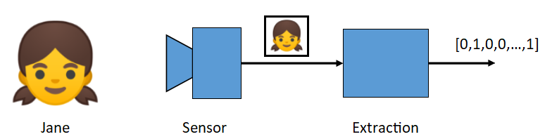
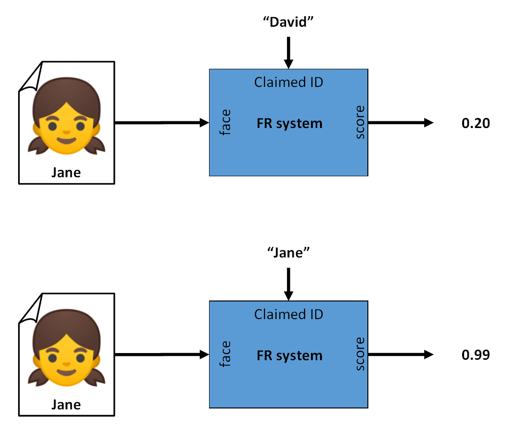
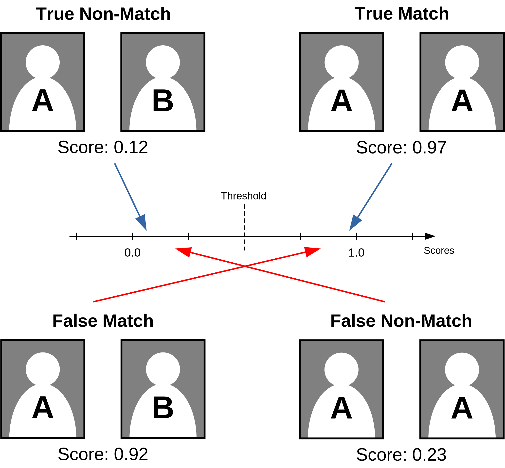
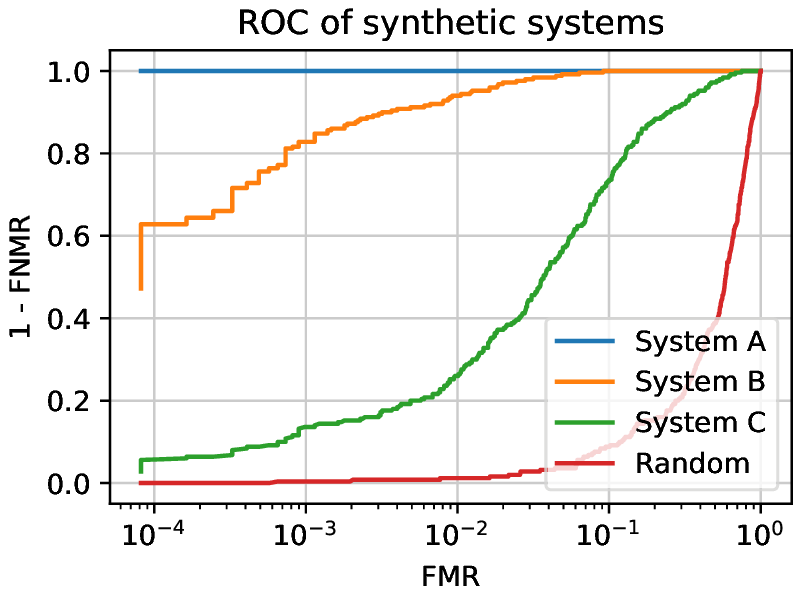
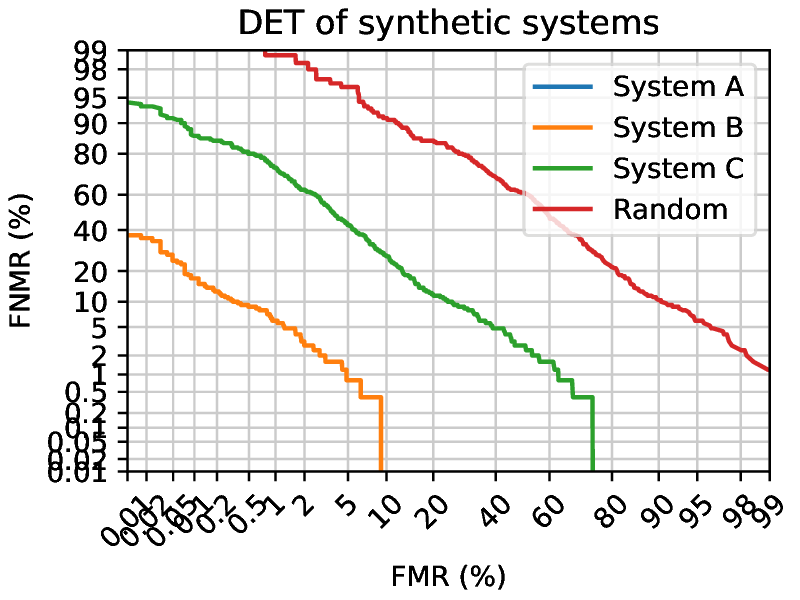
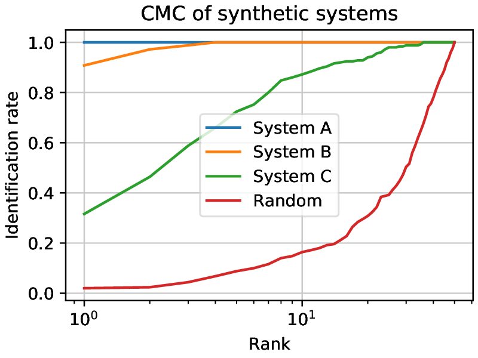
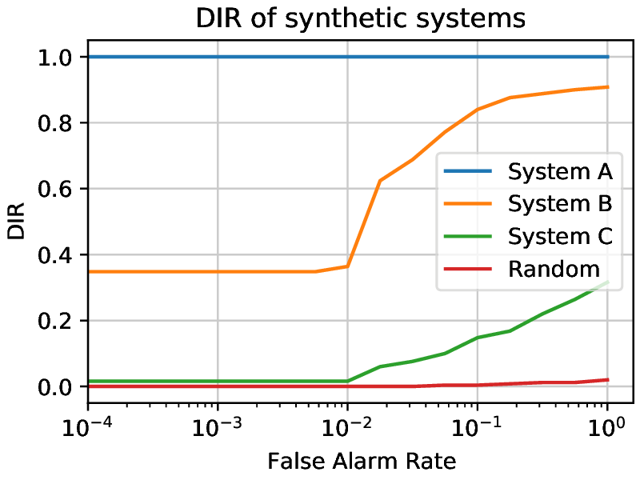

.. author: Tiago de Freitas Pereira <tiago.pereira@idiap.ch>
.. author: Yannick Dayer <yannick.dayer@idiap.ch>
.. date: Wed 03 Aug 2020 17:56:00 UTC+02

..  _bob.bio.base.biometrics_intro:

##########
Biometrics
##########

This section will introduce biometrics and how to recognize people given samples of traits that define them.
It is inspired by the handbook of biometrics ([jain2007handbook]_).
Plots are generated using the :ref:`bob bio suite of tools <bob.bio.base.bob_bio_plots>`.

**********
Definition
**********

Biometrics is the science of establishing the identity of an individual based on measurable physical, behavioral, and/or chemical signals of such a person.

By using biometrics it is possible to establish and confirm an identity based on *who you are* instead of *what you possess* (a key or ID-card), or *what you remember* (a password).
Biometric attributes have the advantage of always be on the person, can not easily be stolen or shared, and can normally not be lost or forgotten.
In some applications, biometrics may be used to supplement an ID-card or a password, adding another level of security (dual-factor authentication).

Usage of biometrics
-------------------

The goal of a biometric system is to associate a measurable biosignal with an identity.
This can be used for a variety of reasons:

- Preventing impostors to access protected resources (bank account, secure area, computer, mobile phone)
- Identifying an unknown individual (corpse identification, missing person)
- Prevent multiple benefits (welfare disbursements double-dipping)
- Prevent denying of access to a resource (claiming that an impostor accessed it with falsified credentials)

Biometric attributes
--------------------

The attributes used to identify a person can be (but are not limited to):

Physical attributes:
  - **Face**: The most commonly used attribute used by humans to identify one another. It is non-intrusive and can be captured at a distance.
  - **Fingerprints patterns**: This attribute has been used for a long time and has very high accuracy. Fingerprints are different between twins.
  - **Voice**: This trait is also commonly used by humans. It can either be a physical or behavioral attribute.
  - **Vein patterns**: Veins follow a path that is unique to individuals, but are not (or only partially) visible without specialized sensors.

Behavioral attributes:
  - **Gait** (way of walking): This can be used to identify people at a distance.
  - **Keystroke patterns**: Each person has a way of typing on a keyboard, allowing to recognize them when typing.
  - **Written signature**: The way a person signs their name is a characteristic of that individual.

Chemical attributes:
  - **DNA**: Although difficult and costly to analyze, DNA is unique to every individual.
  - **Body odor**: It is hypothesized that the chemical composition of sweat and thus body odor, is different enough between individuals to allow identification.

.. note::
    Multiple attributes can also be used together (fusion, multimodal biometrics).

Suitability of biometric attributes
-----------------------------------

Seven factors have been identified to determine if a biometric signal is suitable to be used in a biometric system, and they are the following:

Universality
  Every individual should possess that attribute.

Uniqueness
  The attribute should be sufficiently different between individuals.

Permanence
  The attribute should be sufficiently invariant over time

Measurability
  It should be possible to acquire and digitize the biometric trait without inconvenience for the user.

Performance
  The recognition accuracy and the resources needed to achieve that accuracy should meet the constraints imposed by the application.

Acceptability
  Individuals should be willing to present that biometric trait to the system.

Circumvention
  The attribute used should not be easy to imitate using artifacts or mimicry.

Not all biometric attributes can satisfy all those factors, so the choice of an attribute depends also on the application.

**********************************
Typical biometric system operation
**********************************

A biometric system typically operates on a series of subsystems going from the capture of a sample with a sensor, to feature extraction, to finally either register a subject or estimate the identity of a subject.

Acquisition of the sample
-------------------------

The first step is the acquisition of a sample of the biometric attribute we want to measure. This is done by a sensor.

The type of sensor used will depend on the biometric attribute being captured, it could be an RGB camera (for face recognition), a microphone (voice recognition), or a sensor designed specifically for the task (fingerprint or iris scanners).

The quality of the sensor will also impact the final performance of the system. If it is not reliable, it will produce samples that can be seen as different for the same person, for example, and will make the task of the following steps of the system more difficult.

Preprocessing
-------------

To remove variability on the samples coming from the sensor, a preprocessing step is often present. This operation can normalize a sample (balance contrast and luminosity of an image), or remove unnecessary data (background of an image, silence of a voice recording)

Extraction
----------

Biometric recognition can be seen as a classification problem, where each class is an identity, and captured samples must be assigned to one class.
To ease the process of classification, the input of high dimensionality should be reduced to a feature vector of lower dimension, simpler to classify.
This is done by a transformer (also called an extractor).

A feature vector should represent the identity of an individual, and a difference should be measurable between different individual's vectors.

  Extraction of an identity feature vector from a face picture.

Comparison and Scores
---------------------

Once two feature vectors are extracted, they can be compared to assess the similarity or difference of identity between the two samples from which they originated, for example by measuring the distance between those vectors.

Since there is a lot of variability in biometrics (aging, make-up, clothing, sensor noise), two samples of the same person are not likely to have the exact same feature vector.
Thus, a comparison between the vectors is needed and results in a score that should show how much the samples belong to the same person.

.. _comparison-figure:

  Verification: Two samples extracted and compared, giving a similarity score
  for a wrong identity (top) and a matching identity (bottom). A threshold can
  be applied to get the Yes or No output.

.. note:: The score computed by the comparison can be a similarity score or a
  distance score. For simplicity, only similarity scores will be considered
  below. The higher the score, the most probable two feature vectors represent
  the same person.

.. admonition:: Hands-on
  :class: hint

  You can get the comparison scores of two face images (or more) with this command:

  .. code-block:: shell

    > bob bio compare-samples image_01.jpg image_02.jpg -p gabor_graph

  The required ``-p`` option specifies the pipeline to use (here: Gabor Graph).

Pipelines
---------

The nature of biometric systems being a series of subprocess depending on data produced by the previous step can be thought of in the model of **pipelines**, conducting the data through each operation.

This model will be further described in :ref:`bob.bio.base.pipeline_simple_intro`.

*****************
Recognition types
*****************

There are two main stages in a biometric recognition process:

- **Enrollment**: Associating a biometric measure with an identity. The necessary information (feature vectors) is stored in the system for later comparison.
- **Recognition**: Checking the identity of a biometric measure (via verification or identification) against the previously stored identity information.

There exist multiple ways of handle the recognition process, depending on the application. This process can be either a verification, a closed set identification, or an open set identification.

.. _verification-label:

Verification
------------

Verification consists of first enrolling one or multiple people (references).
Then when verifying, a sample of a biometric feature is presented along with a claimed identity.
The system verifies that the sample belongs to that identity by comparing the features extracted from the proposed sample to the enrolled features corresponding to that claimed identity.

This is a *one-to-one* (1:1) comparison and works as a binary classification problem (it outputs a Yes or No as the presented identity corresponds to the claimed identity or not).

One application for such method could be for access control, where the authorized people are enrolled, and when trying to access the resource, they would be compared against their reference and authorized if similar enough.

Threshold
^^^^^^^^^

Unlike a password system where a perfect match is necessary between two strings of characters, biometric features rarely are identical at different points in time.
This can be due to imperfect sensing conditions (noise in the sensor), alterations in the biometric characteristic (aging, clothing, make-up), changes in ambient conditions (illumination level), or variations in the user interaction with the system (position or occlusion of the feature).
This variability when observed on the feature set of one individual is called intra-class variation.

The degree of similarity between two biometric feature sets is indicated by a score (integer or floating-point number) for each verification.
When comparing two feature sets of the same individual, the similarity score is known as a *genuine* score. If the score is a result of matching the feature sets of different users, it is known as an *impostor* score.

To get the binary answer that we seek, a decision is taken using a threshold value (denoted :math:`\tau`, :math:`\theta`, or :math:`\eta`).
Scores that have a higher value than the threshold are considered *Matches*, and scores lower than the threshold are evaluated as *Non-Matches*.

The choice of a threshold value impacts greatly the results of a system. It represents a trade-off between giving importance to one of the errors a system can commit.

Errors
^^^^^^

Two types of errors can be committed by a verification system:

False Match (FM)
  The presented subject is not the person that was registered with that claimed identity (Condition Negative, *impostor*), but the system matched them as if they had the same identity.

  When working with scores: the system gave a high score (higher than the threshold value) to a pair of different identities.

False Non-Match (FNM)
  The presented subject is the same as it was registered on that claimed identity (Condition Positive, *genuine*), but the system states that they are different people.

  When working with scores: the system returned a low score (lower than the threshold value) for a pair of matching identities.

  All possible cases when comparing two signals coming from either the same person or two different individuals.
  The top cases present the condition when a system correctly scores a pair of feature sets, and the bottom cases show the two error types when a system assigns an unsuitable score.

Evaluation
^^^^^^^^^^

To evaluate a verification system, a significant number of Genuine pairs and Impostor pairs comparisons must be done, to have a good estimate of the performance on the users' population.
Once the scores of each verification are generated, it is possible to compare different systems by using metrics like the FMR or FNMR, for a given threshold value.

Error rates
...........

False Match Rate (FMR)
  The FMR is defined as :math:`\frac{\Sigma\text{ False Match}}{\Sigma\text{ Condition Negative}} = \frac{\text{FM}}{\text{FM}+\text{TNM}}`.
  It represents the number of Impostor pairs of subjects and identities that were recognized as *Matches*.

  A low FMR is good for high-security systems, so fewer impostors would be authorized wrongly.

False Non-Match Rate (FNMR)
  The FNMR is defined as: :math:`\frac{\Sigma\text{ False Non-Match}}{\Sigma\text{ Condition Positive}} = \frac{\text{FNM}}{\text{FNM}+\text{TM}}`.
  It represents the number of Genuine pairs of subjects and identities that were recognized as *Non-Matches*.

  A low FNMR increases user comfort as genuine users won't need to retry multiple times to be recognized by the system.

FMR and FNMR are competing with each other since increasing one by changing the threshold value mean decreasing the other. So depending on the application, we may choose a threshold value that results in a low FMR or a low FNMR.

Half Total Error Rate
.....................

The Half Total Error Rate (HTER) is an aggregate measure representing both types of errors a system commits. It is defined as:

.. math:: \text{HTER} = \frac{\text{FMR} + \text{FNMR}}{2}

Equal Error Rate
................

The Equal Error Rate (EER) is a criterion used to define the threshold value such that it minimizes both types of error rates (:math:`\text{FMR} = \text{FNMR}`). It defines the threshold as:

.. math:: \theta^* = \text{arg}\min\limits_{\theta} \mid \text{FMR}(\theta) - \text{FNMR}(\theta) \mid

ROC, DET, and EPC
.................

To decide which threshold value is the best for an application, and to compare different systems, the Receiver Operation Characteristic (ROC) and Detection Error Tradeoff (DET) curves were defined, as well as the Expected Performance Curve (EPC).

A ROC curve presents the True Match Rate (TMR, or 1-FNMR) against the FMR for different threshold values.
A perfect system would have a point at an FMR of 0 and a TMR of 1 (See *System A*, in :numref:`roc-example-figure` ). The closer the curve is to that point, the better a system is generally.
Another way to compare systems is to measure the Area Under the Curve (AUC). A bigger AUC means a better system (globally).

.. _roc-example-figure:

  ROC curves of synthetic systems presenting the differences between different systems. *Random* is the worst possible case, where the system generates scores completely at random.
  For every working point, *System C* is performing worse than *System B*, as for each FMR, the corresponding TMR is lower. *System A* is not making any errors.
  (Note that the x-axis is logarithmic to better use the plot area.)

A DET curve shows the FNMR against the FMR for different threshold values of the scores of a system.

  DET curves of synthetic systems presenting the difference between different systems.
  *System A* has an FMR of 0 and an FNMR of 0, outside of the graph range.
  *Random* is the worst possible case, where the system generates scores completely at random.

Closed set identification
-------------------------

For closed set identification, all the possible identities are enrolled into the system.
On use, a biometric sample (probe) is compared to every element of the enrolled set, and the most probable identity is returned.
This is a *one-to-many* (1:N) operation and is more costly than a verification. The system must compare a given sample to every identity that is registered.
However, the presented sample belongs to one of the enrolled subjects, as it is a closed set of known identities.

This is used for example for searching the identity of a biometric sample in a given database (e.g. a fingerprint taken from a crime scene, compared against a list of suspects' fingerprints)

Errors - Rank
^^^^^^^^^^^^^

To decide which enrolled identity (model) corresponds to the identity of the probe, the system assigns scores to each comparison made and the highest score is assumed to represent the matching identity.

A closed set identification system commits an error when the highest score returned does not correspond to the correct identity.
The term *rank* is used to define how good or bad a guess is.
If the correct identity has the highest score (expected result) this is a rank 1 guess.
If the correct identity has the second highest score, its rank is 2, and so on.
The highest the rank, the worst a guess is.

Evaluation - CMC
^^^^^^^^^^^^^^^^

To evaluate the performance of a system working in identification, the Cumulative Match Curve (CMC) was defined.
It shows how many samples were detected at which rank by plotting the number of correctly guessed identities for each rank.

The leftmost point shows how many rank 1 guesses were achieved, the second one cumulates the count of rank 1 and rank 2 guesses, and so on.
A perfect system would have the rank 1 count at the number of guesses (so the CMC would be constant).

  Three closed set synthetic systems being evaluated and a set of random scores presented on a CMC curve.
  The higher the rank, the more matches are correctly identified.
  *System A* achieves a perfect performance.
  *System B* has a higher identification rate than *System C* for each rank.
  Random shows the worst possible case.
  The rank spans from 1 to 50, since the experiments were done with 50 subjects.

Open set identification
-----------------------

Extending the closed set identification, the open set identification takes into account the possibility that the individual represented by a sample is not present in the set of registered identities (*references*).
The system has to report if the presented person has been enrolled, and if so, should return the identity of that person.

This is used for searching a person in a database where its presence is not guaranteed.
Searching for a fingerprint taken on a crime scene in a list of known criminals (but not knowing if *The One* is in that list), for example.

To operate, an open set identification system will perform two main operations:

- Estimate if the probe sample identity is in the set of *known* individuals, and
- Which one of the *known* individuals corresponds the most to the identity of the probe sample.

To do so, the system must compare the probe against all the *known* models and retrieve a score for each comparison.
To test if that probe identity is of a *known* or an *unknown* individual, a first threshold value is defined that will decide if a probe is in the set of *known* individuals (alarm, acceptation, or detection) or not (rejection).
If all the similarity scores land under that threshold value (theoretically all comparisons are non-matches), the probe identity is decided to be *unknown*.
If one (or more) score lands over the threshold value (named *alarm(s)*), a similar ranking method that the one used in `Closed set identification`_ is applied:
The highest score gets the rank one and is decided to be the matching identity.

See [jain2011handbook]_, chapter 21 for more details.

Errors
^^^^^^

There are two errors to consider for open-set identification systems.
Firstly, an *unknown* probe could be considered as *known* (False Alarm), or inversely (False rejection).
Secondly, when a probe is correctly considered as *known*, there is an error when the rank one model is not of the correct identity (*detection and identification at rank n*).

Evaluation - Detection and Identification Rate Curve
^^^^^^^^^^^^^^^^^^^^^^^^^^^^^^^^^^^^^^^^^^^^^^^^^^^^

The general open-set identification performance can be plotted along three axes: detection and identification rate, false alarm rate, and rank.
The performance of systems is however often plotted as a two-dimensional slice with one of the variables set to a value.

Commonly, the Detection and Identification Rate (DIR) curve uses a rank of 1 and plots the detection and identification rate against the false alarm rate.

  Three open set synthetic systems being evaluated and a set of random scores presented on a DIR curve.
  The rank is set to one and the detection and identification rate is plotted against the false alarm rate.
  *System A* achieves a perfect performance.
  *System B* has a higher dir than *System C* for every FAR value.
  Random shows the worst possible case.
  The experiments were done with 50 known subjects and 50 unknown subjects.

********
Datasets
********

To evaluate systems for biometric recognition, a series of comparisons (verification or identification) must be done on a set of biometric signals originating from a great number of individuals.
To ease the process of researchers and systems designers, datasets of such signals were created. For example, face picture datasets exist where multiple photographs of various people can be used for training or evaluation of face recognition systems.

Multiple datasets exist for each biometric trait, each with different properties:

Relevance
  For which tasks the dataset was designed (verification, identification, training, evaluation).

Dataset size
  The number of individuals represented in the dataset. For example, a set of 40 subjects (like the AT&T face recognition dataset) could be insufficient to evaluate a system.

Demographic distribution
  The variety in gender, race, age, and other demographic properties of the individuals. A system trained on a dataset containing mainly white males subjects will have a worse performance during evaluation on subjects of other demographics.

Sensor used for capture
  The sensor used for capturing the data.

Metadata
  What type of additional information is available, like the positions in an image, the date of acquisition, the sensor used, the demographic characteristics, the elapsed time between acquisitions, ...

Partitioning
------------

To train and evaluate biometric systems, different groups of subjects must be defined. The most common groups that are used are:

World set
  This set is used for the training of a system. It should be large enough to prevent overfitting.

Development set (dev)
  This set of subjects is used at evaluation time, to define parameters that would be set before the final use of the system. Generally, it is used to define the score threshold value.

Evaluation set (eval)
  This set is used to evaluate the performance of a system, given a threshold value. It represents the final users accessing the system in normal usage.

Each group's population repartition is important to take into consideration. If a certain demographic is missing in the world set, for example, the system could be biased and not perform well on subjects of this demographic during evaluation.

Legal issues
------------

Biometric data is collected from humans, hence legal requirements for the protection of the identity of experimental subjects are applicable in most jurisdictions.
Most datasets will require the user to sign an agreement on the use of the data, ensuring the privacy of the identity of the subjects.

For this reason, only dataset interfaces are available in this package set, the data itself needing to be acquired independently.

**********
References
**********

.. [jain2007handbook]       * Jain, Anil K, and Flynn, Patrick and Ross, Arun A. **Handbook of biometrics**, 2007, Springer Science & Business Media
.. [jain2011handbook]       * Jain, Anil K, and Li, Stan Z. **Handbook of face recognition** *second edition*, 2011, Springer

.. include:: links.rst
