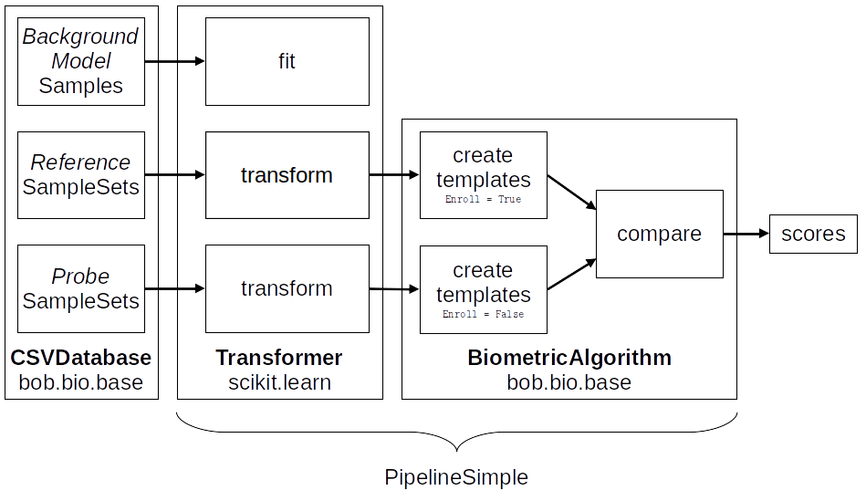

.. author: Yannick Dayer <yannick.dayer@idiap.ch>
.. date: Mon 26 Sep 2022 10:35:22 UTC+02

.. _ bob.bio.base.database_interface:

====================
 Database Interface
====================

This is the description of how to feed data to a bob biometric pipeline.

The data originates from raw files (face pictures for a face recognition dataset) that
can be stored in a multitude of formats and structure. The Database interface role is
to take those files and group them in a way that makes sense for our pipeline system.

  The sub-pipelines of a biometric experiment. The data of *references* is used for
  enrollment and the data of *probes* is used for scoring. Note that there is only one
  comparison set presented here (either *dev* or *eval*).

A biometric pipeline normally expects an optional *train* set, the reference and probe
data for a *dev* group, and the reference and probe data for an optional *eval* group.

When scoring, all the probes are compared to all the references, unless a list of
comparisons is specified.

The :py:class:`CSVDatabase` class will expect a series of CSV files indicating how to
create samples to feed to each sub-pipeline. They need to follow a specific file
structure.

Protocol definition files
=========================

The database for biometric experiments needs a slightly more complex structure as `the
default from bob.pipelines <bob.pipelines.csv_database>`_.
On top of the *protocol* and *group* classification, we must add a *purpose* "layer"
(e.g. to differentiate between enrollment and scoring).
Each sub-pipeline will take a different list of samples, like an *enrollment* set of
samples and a *probe* set, for each group in each protocol.

To do so, the structure of CSV files is as follow::

  <dataset_protocol_path>/<protocol>/<group>/<purpose>.csv

Here is an example with names:

.. code-block:: text

  database_name
   |
   +- default_protocol
       |
       +- train
       |   |
       |   +- for_background_model.csv
       |
       +- dev
       |   |
       |   +- for_enrolling.csv
       |   +- for_probing.csv
       |   +- for_matching.csv
       |
       +- eval
           |
           +- for_enrolling.csv
           +- for_probing.csv
           +- for_matching.csv

In this database definition of ``database_name`` we have one protocol
``default_protocol``, three groups ``train``, ``dev``, and ``eval`` which contain
different set of samples for the purpose of enrollment and scoring (except train that
has just one pool of samples in this case).

- The ``for_enrolling.csv`` files define the creation of samples for enrollment
  purposes. Those samples will create the enrolled references.
- The ``for_probing.csv`` files dictate to create samples for probes that will be
  compared against the enrolled references.
- The optional ``for_matching.csv`` files contains the list of comparisons that will
  be made between samples in ``for_enrolling.csv`` and ``for_probing.csv``. If this
  file is not present, all the probes will be compared against all the references.

Tar archive
-----------

To save space, the databases are usually compressed in a tar archive. Those are
natively supported by bob and can be passed as ``dataset_protocol_path`` to the
:any:`CSVDatabase` directly:

.. code-block:: python

  db = CSVDatabase(name="atnt", dataset_protocol_path="~/db/atnt_protocols.tar.gz")

If you want to create such an archive while making the database definition file, you
can use the python tar module as follow (with CSV files already created):

.. code-block:: python

  import tarfile
  with tarfile.open("your_definition_archive.tar.gz", "w:gz") as tar:
    tar.add("path/to/your_csv_structure", arcname="your_db_name")

Or with the following bash command::

  tar -cvzf your_definition_archive.tar.gz -C path/to/your_csv_structure your_db_name

To ensure compatibility with bob, make the first level folder name the same as the
database ``name`` parameter.

Existing databases definitions
------------------------------

For known databases, we provide definition files on
`our server <https://www.idiap.ch/software/bob/data/bob>`_. If they are correctly
configured in the package you are using, bob will download them automatically when
instantiating the :class:`CSVDatabase`.

The downloaded database definition files will be stored in the ``bob_data``
configuration.

The default location of ``bob_data`` is ``~/bob_data/`` but this can be changed with::

  bob config set bob_data "/your/custom/path/to/bob_data"

Format of definition files
--------------------------

All protocol definition files should be in plain text and follow the CSV format with a
header. Here is an example of the head of ``for_enrolling.csv`` file:

.. code-block:: text

  path,template_id,metadata1,metadata2
  dev/u01/s01.png,u01s01,male,29
  dev/u01/s02.png,u01s02,male,29
  dev/u02/s01.png,u02s01,female,32
  [...]

Note that the paths should be relative to the ``original_directory``, passed to the
:py:class:`CSVDatabase`. This allows to easily change the install location of a dataset
while keeping the same CSV files. ``original_directory`` can change as the dataset are
not provided by bob and should be acquired by the user for legal reasons (some datasets
are not accessible freely).
