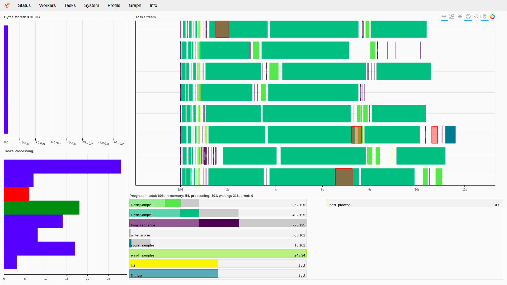
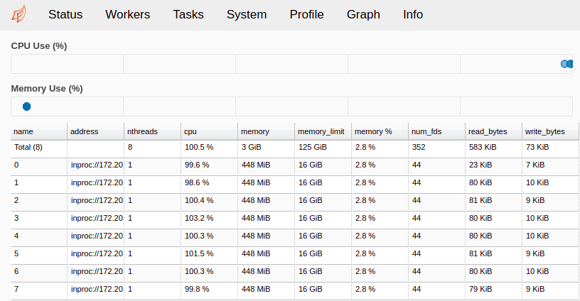
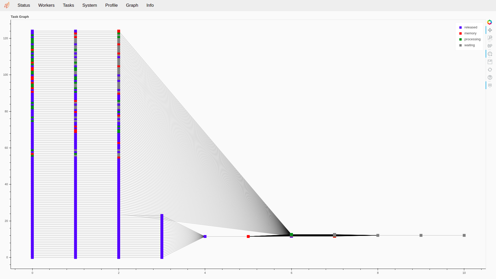

.. author: Tiago de Freitas Pereira <tiago.pereira@idiap.ch>
.. author: Yannick Dayer <yannick.dayer@idiap.ch>
.. date: Wed 24 Sep 2020 07:40:00 UTC+02

..  _bob.bio.base.pipeline_simple_advanced_features:

=================================
PipelineSimple: Advanced features
=================================

There are several extra features that you can attach to the PipelineSimple.
In this section we'll explain the database interface, checkpointing of experiments, multitasking with Dask, and score file formats.

.. _bob.bio.base.database_interface:

The database interface
======================

A database interface is responsible for providing data samples to the pipeline when requested so.
It is the starting point of each sub-pipelines of PipelineSimple: Train, Enroll and Score.

.. note::

  Since the bob packages do not include the actual data, the database interfaces
  need to be set up so that a path to the data is configurable. The interface
  only knows the file structure from that path and loads the data at runtime.
  Consult the documentation of each database to learn how to do this.

Groups of subjects are defined for the different parts of a biometric experiment.

  - The *world* set is used to train the model.
  - The *dev* set is used to enroll and score the subjects to define a working point for the system (setting a threshold value).
  - And for a complete experiment, the *eval* set is used to evaluate the performance of a biometric system on the working point given by the *dev* set scoring.

Each set must contain samples from individuals that are not represented in any other set.

Those set are then used in the experiment's pipeline:

  - The *world* set is passed to the training sub-pipeline to fit the transformers' background model.
  - Several samples (enough to enroll an individual) from each subject of the *dev* set are passed to the enroll sub-pipeline as references.
  - The rest of the samples of the *dev* set, the *probes*, are passed to the scoring sub-pipeline to generate the ``scores-dev`` file.
  - If needed, the last two steps are repeated for the *eval* set of subjects, to generate the ``scores-eval`` file.

Using a database interface
--------------------------

You may list the currently available databases (and pipelines) using the following command::

  bob bio pipeline simple --help

You can use such a dataset with the following command (example with the AT&T dataset)::

  bob bio pipeline simple atnt <pipeline_name>

For more exotic datasets, you can simply pass your custom database file (defining a ``database`` object) to the PipelineSimple::

  bob bio pipeline simple my_database.py <pipeline_name>

The ``database`` object defined in ``my_database.py`` is an instance of either:

- A :py:class:`bob.bio.base.database.CSVDatabase` (see :ref:`here <bob.bio.base.database.csv_file_interface>`),
- Your implementation of a :ref:`Database Interface <bob.bio.base.database.interface_class>`,

.. _bob.bio.base.database.csv_file_interface:

CSV file Database interface
---------------------------

The easiest way to create a database interface is to use the CSV file interface.
This method is less complete and less flexible than implementing a :ref:`full interface class <bob.bio.base.database.interface_class>` but is sufficient for most use cases.

Protocol definition is possible and a set of CSV files (at least ``dev_enroll.csv`` and ``dev_probe.csv``) in a folder must be created for each protocol.

The interface is created with :py:class:`bob.bio.base.database.CSVDatabase`.
This class takes as input the base directory and the protocol sub-directory of
the :ref:`CSV file structure <bob.bio.base.database.csv_file_structure>`, and
finally, a ``csv_to_sample_loader`` that will load a sample data from a CSV row
read from the CSV files. This ``csv_to_sample_loader`` needs to know the dataset
base path and the extension of the dataset files.

File format
^^^^^^^^^^^

You must provide a series of *comma separated values* (CSV) files containing at least two columns with a header:

.. code-block:: text

  PATH,TEMPLATE_ID
  data/model11_session1_sample1,1
  data/model11_session1_sample2,1
  data/model11_session1_sample3,1
  data/model11_session2_sample1,1
  data/model12_session1_sample1,2
  data/model12_session1_sample2,2
  data/model12_session1_sample3,2
  data/model12_session2_sample1,2

The required columns in each file are the path to a sample (header: ``PATH``, relative to the dataset root) and a unique identifier for the individual represented by the sample (header: ``TEMPLATE_ID``).

Metadata
........

This interface allows metadata to be shipped with the samples. To do so, simply add columns in the CSV file, with a corresponding header:

.. code-block:: text

  PATH,TEMPLATE_ID,MY_METADATA_1,METADATA_2
  data/model11_session1_sample1,1,F,10
  data/model11_session1_sample2,1,F,10
  data/model11_session1_sample3,1,F,10
  data/model11_session2_sample1,1,F,10
  data/model12_session1_sample1,2,M,30
  data/model12_session1_sample2,2,M,30
  data/model12_session1_sample3,2,M,30
  data/model12_session2_sample1,2,M,30

.. _bob.bio.base.database.csv_file_structure:

File structure
^^^^^^^^^^^^^^

The following file structure and file naming must be followed, for the class to find the CSV files:

.. code-block:: text

  my_dataset
  |
  +-- my_protocol_1
  |   |
  |   +-- dev
  |      |
  |      +-- for_models
  |      +-- for_probes
  |
  +-- my_protocol_2
      |
      +-- norm
      |    |
      |    +-- train_world.csv
      |
      +-- dev
      |   |
      |   +-- for_models.csv
      |   +-- for_probes.csv
      |
      +-- eval
           |
           +-- for_models.csv
           +-- for_probes.csv

- The minimal required files are the ``dev_enroll.csv`` and ``dev_probe.csv``, containing the sample paths and subjects of the *dev* set.
- The ``train.csv`` file (as shown in ``my_protocol_2``) is optional and contains the information of the *world* set.
- The ``eval_enroll.csv`` and ``eval_probe.csv`` files (as shown in ``my_protocol_2``) are optional and contain the information of the *eval* set.

In this example, ``my_dataset_csv_folder`` would be the base path given to the ``dataset_protocols_path`` parameter of :py:class:`bob.bio.base.database.CSVDatabase`, and ``my_protocol_1`` the ``protocol`` parameter:

.. code-block:: python

    from bob.bio.base.database import CSVDatabase, AnnotationsLoader
    import bob.io.base

    # Define a loading function called for each sample with its path
    def my_load_function(full_path):
        # Example with image samples
        return bob.io.base.load(full_path)

    # Create a loader that takes the root of the dataset and a loader function
    my_sample_loader = CSVToSampleLoader(
        data_loader=my_load_function,
        dataset_original_directory="/path/to/dataset/root",
        extension=".png",
        metadata_loader=AnnotationsLoader()
    )

    # Create the CSV interface
    database = CSVDatabase(
      name="my_dataset",
      dataset_protocols_path="my_dataset_csv_folder",
      protocol="my_protocol_1",
      transformer=my_sample_loader
    )

This will create a database interface with:

- The elements in ``train_world.csv`` returned by :py:meth:`bob.bio.base.database.CSVDatabase.background_model_samples`,
- The elements in ``for_models.csv`` returned by :py:meth:`bob.bio.base.database.CSVDatabase.references`,
- The elements in ``for_probes.csv`` returned by :py:meth:`bob.bio.base.database.CSVDatabase.probes`.

An aggregation of all of the above is available with the
:py:meth:`bob.bio.base.database.CSVDatabase.all_samples` method, which returns
all the samples of the protocol.

.. _bob.bio.base.database.interface_class:

The database interface class
----------------------------

Although most of the experiments will be satisfied with the CSV or cross-validation interfaces, there exists a way to specify exactly what is sent to each sub-pipelines by implementing your own database interface class.

When a PipelineSimple requests data from that class, it will call the following methods, which need to be implemented for each dataset:

  - :py:meth:`bob.bio.base.pipelines.Database.background_model_samples`:
    Provides a list of :py:class:`bob.pipelines.Sample` objects that are used for
    training of the Transformers.
    Each :py:class:`bob.pipelines.Sample` must contain at least the attributes
    ``bob.pipelines.Sample.key`` and
    ``bob.pipelines.Sample.subject``, as well as the
    ``bob.pipelines.Sample.data`` of the sample.
  - :py:meth:`bob.bio.base.pipelines.Database.references`: Provides a list of :py:class:`bob.pipelines.SampleSet` that are used for enrollment of the models.
    The group (*dev* or *eval*) can be given as parameter to specify which set
    must be used. Each :py:class:`bob.pipelines.SampleSet` must contain a
    ``bob.pipelines.SampleSet.subject`` attribute and a list of
    ``bob.pipelines.Sample`` containing at least the
    ``bob.pipelines.Sample.key`` attribute as well as the
    ``bob.pipelines.Sample.data`` of the sample.
  - :py:meth:`bob.bio.base.pipelines.Database.probes`: Returns a list of :py:class:`bob.pipelines.SampleSet` that are used for scoring against a previously enrolled model.
    The group parameter (*dev* or *eval*) can be given to specify from which set
    of individuals the data comes. Each :py:class:`bob.pipelines.SampleSet`
    must contain a ``bob.pipelines.SampleSet.subject``, a
    ``bob.pipelines.SampleSet.references`` list, and a list of
    ``bob.pipelines.Sample`` containing at least the
    ``bob.pipelines.Sample.key`` attribute as well as the
    ``bob.pipelines.Sample.data`` of the sample.

Furthermore, the :py:meth:`bob.bio.base.pipelines.Database.all_samples` method must return a list of all the existing samples in the dataset. This functionality is used for annotating a whole dataset.

Here is a code snippet of a simple database interface:

.. code-block:: python

    from bob.pipelines import Sample, SampleSet
    from bob.bio.base.pipelines import Database

    class CustomDatabase(Database):
        def background_model_samples(self):
            train_samples = []
            for a_sample in dataset_train_subjects:
                train_samples.append( Sample(data=a_sample.data, key=a_sample.sample_id) )
            return train_samples

        def references(self, group="dev"):
            all_references = []
            for a_subject in dataset_dev_subjects:
                current_sampleset = SampleSet(samples=[], template_id=a_subject.id)
                for a_sample in a_subject:
                    current_sampleset.insert(-1, Sample(data=a_sample.data, key=a_sample.sample_id))
                all_references.append(current_sampleset)
            return all_references

        def probes(self, group="dev"):
            all_probes = []
            for a_subject in dataset_dev_subjects:
                current_sampleset = SampleSet(samples=[], template_id=a_subject.id, references=list_of_references_id)
                for a_sample in a_subject:
                    current_sampleset.insert(-1, Sample(data=a_sample.data, key=a_sample.sample_id))
                all_probes.append(current_sampleset)
            return all_probes

        def all_samples(self, group=None):
            all_subjects = dataset_train_subjects + dataset_dev_subjects
            all_samples = []
            for a_sample in all_subjects:
                all_samples.append( Sample(data=a_sample.data, key=a_sample.sample_id) )
            return all_samples

        def groups(self):
            return list(("train", "dev", "eval"))

        def protocols(self):
            return list(("protocol_1", "protocol_2"))

    database = CustomDatabase()

.. note::

  For optimization reasons, an ``score_all_vs_all``
  flag can be set in the database interface (see
  :any:`bob.bio.base.pipelines.Database`) to allow scoring
  with all biometric references. This will be much faster when your algorithm
  allows vectorization of operations, but not all protocols allow such a
  feature.

  - When this flag is ``True``, the algorithm will compare a probe sample and generate the scores against **every** model of the set returned by the ``references`` method.
  - Otherwise (flag is ``False``), the scoring algorithm will only compare a probe to the given ``bob.pipelines.SampleSet.references` attribute of its :py:class:`bob.pipelines.SampleSet``.

Delayed samples
^^^^^^^^^^^^^^^

To work with datasets too big to fit entirely in memory, the :py:class:`bob.pipelines.DelayedSample` was introduced.

The functionality is the same as a :py:class:`bob.pipelines.Sample`, but instead
of storing the data as an attribute directly, a ``load`` funciton is used that
can be set to any function loading one sample of data. When data is needed, the
load function is called and the sample data is returned.

Checkpointing experiments
=========================

Checkpoints are a useful tool that allows an experiment to prevent computing data multiple times by saving the results of each step so it can be retrieved later.
It can be used when an experiment fails in a later stage, preventing the computation of the stages coming before it, in case the experiment is restarted.

The checkpoints are files created on disk that contain the result of a sample of data passed through a Transformer or :any:`bob.bio.base.pipelines.BioAlgorithm`.
When running, if the system finds a checkpoint file for its current processing step, it will load the results directly from the disk, instead of computing it again.

To enable the checkpointing of a Transformer or :any:`bob.bio.base.pipelines.BioAlgorithm`, a :py:class:`bob.pipelines.CheckpointWrapper` is available.
This class takes a Transformer as input and returns the same Transformer with the ability to automatically create checkpoint files.
The :py:class:`bob.pipelines.CheckpointWrapper` class is available in the :py:mod:`bob.pipelines`.

The ``--checkpoint`` option is a command-line option that automatically wraps every steps of the pipeline with checkpointing.
If set, the ``--checkpoint-dir`` sets the path for such a checkpoints::

  bob bio pipeline simple <database> <pipeline> --checkpoint --output <output_dir> --checkpoint-dir <checkpoint_dir>

When doing so, the output of each Transformer of the pipeline will be saved to the disk in the ``<checkpoint_dir>`` folder specified with the ``--checkpoint-dir`` option.
Output scores will be saved on ``<output_dir>``.

.. WARNING::

  You have to be careful when using checkpoints: If you modify an early step of
  an experiment, the created checkpoints are not valid anymore, but the system
  has no way of knowing that.

  **You** have to take care of removing invalid checkpoints files.

  When changing the pipeline or the dataset of an experiment, you should change
  the output folder (``--checkpoint-dir``) accordingly. Otherwise, the system could try to
  load a checkpoint of an older experiment, or samples from another dataset.

Scaling up with Dask
====================

`Dask <https://www.dask.org>`__ is a library that allows advanced parallelism of python programs.
This library takes care of creating jobs that can execute python code in parallel, schedules the execution of those jobs on the available resources, and manages the communication between those jobs.
Dask jobs can run in parallel on the same machine, or be spread on a *grid* infrastructure.
Diagnostic and monitoring tools are also available to watch progress and debug.

Using Dask with PipelineSimple
------------------------------

To run an experiment with Dask, a :py:class:`bob.pipelines.DaskWrapper` class is available that takes any Transformer or :any:`bob.bio.base.pipelines.BioAlgorithm` and outputs a *dasked* version of it.

You can easily benefit from Dask by using the ``--dask-client`` option like so::

  bob bio pipeline simple <database> <pipeline> --dask-client <client-config>

where ``<client-config>`` is your own dask client configuration file, or a resource from ``bob.pipelines.distributed``:

- ``local-parallel``: Launches as many jobs as :py:func:`multiprocessing.cpu_count` that will run simultaneously on the current machine.
- ``sge``: Runs jobs on a grid architecture, on any workers (at Idiap, uses the SGE. Other grids may require more configuration, see :py:mod:`bob.pipelines`).
- ``sge-gpu``: Executes jobs on a grid architecture, but defaults to the nodes with a GPU (q_short_gpu).

.. note::

  If the dask option is not set (omitting the ``-l``), everything will run locally in one single thread.

.. warning::

  **For Idiap users:** If you need to run the PipelineSimple in the SGE. Don't forget to do::

    SETSHELL grid

  Also, since the grid nodes are not allowed to create additional jobs on the grid, you cannot run the main dask client on a job (``qsub -- bob bio pipeline simple -l sge_...`` will not work).

Monitoring and diagnostic
-------------------------

A running instance of Dask will create a server with a listening port (default: port 8787) that answers to HTTP requests.
This means that when an instance of Dask is running, you can open `localhost:8787 <http://localhost:8787>`_ in your browser to monitor the running jobs.

The page available contains some useful tools like a graphical visualization of the jobs and their dependencies, a resources monitor (CPU and memory of each node), and access to the logs of all running and finished jobs.

  The *Status* page of the Dask monitoring tool. 8 jobs are running in parallel with different steps being processed.

  The *Workers* page of the Dask monitoring tool. 8 workers are accepting jobs, and their current memory and CPU usage are plotted.

  The *Graph* page of the Dask monitoring tool. We can observe the different steps of a biometric experiment, with the bottom part being the enrollment of references and the top part the probes used for scoring.
  The input are on the left side, and the resulting scores are generated by the jobs on the right.

..  _bob.bio.base.score_formats:

Writing scores in a customized manner
=====================================

The results of the PipelineSimple are scores that can be analyzed.
To do so, the best way is to store them on disk so that a utility like ``bob bio metrics`` or ``bob bio roc`` can retrieve them.
However, many formats could be used to store those score files, so :any:`bob.bio.base.pipelines.ScoreWriter` was defined.

A :py:class:`bob.bio.base.pipelines.ScoreWriter` must implement a :py:meth:`bob.bio.base.pipelines.ScoreWriter.write` method that receives a list of :py:class:`bob.pipelines.SampleSet` that contains scores as well as metadata (subject identity, sample path, etc.).

Common :py:class:`bob.bio.base.pipelines.ScoreWriter` are available by default:

- A CSV format ScoreWriter
- A four columns format ScoreWriter

Using a specific Score Writer
-----------------------------

By default, PipelineSimple will use the CSV format ScoreWriter.

To indicate to a pipeline to use the four-columns ScoreWriter instead
of the default CSV ScoreWriter, you can pass the ``--write-column-scores`` option like so::

  bob bio pipeline simple --write-column-scores <database> <pipeline> --output <output_dir>

CSV Score Writer
----------------

A :py:class:`bob.bio.base.pipelines.CSVScoreWriter` is available, creating a Comma Separated Values (CSV) file with all the available metadata of the dataset as well as the score of each comparison.
It is more complete than the :py:class:`bob.bio.base.pipelines.FourColumnsScoreWriter` and allows analysis of scores according to sample metadata (useful to analyze bias due to e.g. age or gender).

The default :py:class:`bob.bio.base.pipelines.CSVScoreWriter` will write a *probe* subject and key, a *biometric reference* subject, the score resulting from the comparison of that *probe* against the *reference*, as well as all the fields set in :py:class:`bob.pipelines.SampleSet` by the :ref:`database interface<bob.bio.base.database_interface>`, for the *references* and the *probes*.

A header is present, to identify the metadata, and the values are comma separated.
Here is a short example of such file format with metadata on the ``age`` and ``gender`` of the subject:

.. code-block:: none

  probe_subject, probe_key, probe_age, probe_gender, bio_ref_subject, bio_ref_age, bio_ref_gender, score
  subj_0, subj0_sample0, 27, male, subj_0, 29, male, 0.966
  subj_0, subj0_sample0, 29, male, subj_1, 45, female, 0.127
  subj_1, subj1_sample0, 45, female, subj_2, 40, female, 0.254
  subj_1, subj1_sample1, 46, female, subj_2, 40, female, 0.287

Four Columns Score Writer
-------------------------

:py:class:`bob.bio.base.pipelines.FourColumnsScoreWriter` is the old score file format used by bob.
It consists of a text file with four columns separated by spaces and no header.
Each row represents a comparison between a *probe* and a *model*, and the similarity score resulting from that comparison.
The four columns are, in order:

1) **Reference ID**: The identity of the *reference* or *model* used for that comparison (field ``subject`` in :py:class:`bob.pipelines.SampleSet` of the ``references`` set).
2) **Probe ID**: The identity of the *probe* used for that comparison (field ``subject`` in :py:class:`bob.pipelines.SampleSet` of the ``probes`` set).
3) **Probe key**: A unique identifier (often a file path) for the sample used as *probe* for that comparison.
4) **Score**: The similarity score of that comparison.

Here is a short example of such file format:

.. code-block:: none

  subj_0 subj_0 subj0_sample0 0.998
  subj_0 subj_0 subj0_sample1 0.985
  subj_0 subj_1 subj1_sample0 0.450
  subj_0 subj_1 subj1_sample1 0.289

Evaluation
==========

Once scores are generated for each probe evaluated against the corresponding models, conclusions on the performance of the system can be drawn by using metrics like the FMR and FNMR or tools like the ROC curve.

In this section, commands that help to quickly evaluate a set of scores by
generating metrics or plots are presented. The scripts take as input either a
csv file or a legacy four/five column format. See
:ref:`bob.bio.base.score_formats` for the explanation of their formats.

.. note::

  If both *dev* and *eval* scores are available, the scores of the *dev* set will be used to define the threshold used to evaluate the scores of the *eval* set.

Metrics
-------

To calculate the threshold using a certain criterion (EER (default), FAR, or
min.HTER) on a development set and apply it on an evaluation set, just do:

.. code-block:: sh

  $ bob bio metrics -e output/scores-{dev,eval}.csv --legends ExpA --criterion min-hter

  [Min. criterion: MIN-HTER ] Threshold on Development set `ExpA`: -1.399200e-01
  =====================  ==============  ==============
  ..                     Development     Evaluation
  =====================  ==============  ==============
  Failure to Acquire     0.0%            0.0%
  False Match Rate       2.4% (24/1000)  1.9% (19/1000)
  False Non Match Rate   0.0% (0/250)    2.0% (5/250)
  False Accept Rate      2.4%            1.9%
  False Reject Rate      0.0%            2.0%
  Half Total Error Rate  1.2%            1.9%
  =====================  ==============  ==============

.. note::

  When evaluation scores are provided, the ``--eval`` option must be passed.
  See ``metrics --help`` for further options.

  The ``scores-{dev,eval}.csv`` brace expansion (a bash feature) expands the
  path to every element in the list. here: ``scores-dev.csv scores-eval.csv``.

.. _bob.bio.base.bob_bio_plots:

Plots
-----

Customizable plotting sub-commands are available in the :py:mod:`bob.bio.base`
module (command: ``$ bob bio``). They take a list of development and/or
evaluation files and generate a single PDF file containing the plots.

Available plots are:

*  ``roc`` (receiver operating characteristic)
*  ``det`` (detection error trade-off)
*  ``epc`` (expected performance curve)
*  ``hist`` (histograms of scores with threshold line)
*  ``cmc`` (cumulative match characteristic)
*  ``dir`` (detection & identification rate)

Use the ``--help`` option on the above-cited commands to find-out about more
options.

For example, to generate a CMC curve from development and evaluation datasets:

.. code-block:: sh

  bob bio cmc -v --eval --output 'my_cmc.pdf' dev-1.csv eval-1.csv dev-2.csv eval-2.csv

where ``my_cmc.pdf`` will contain CMC curves for the two experiments represented
by their respective *dev* and *eval* scores-file.

.. note::

  By default, ``det``, ``roc``, ``cmc``, and ``dir`` plot development and
  evaluation curves on different plots. You can forcefully gather everything in
  the same plot using the ``--no-split`` option.

.. note::

  The ``--figsize`` and ``--style`` options are two powerful options that can
  dramatically change the appearance of your figures. Try them! (e.g.
  ``--figsize 12,10 --style grayscale``)

Bob bio evaluate
----------------

A convenient command ``evaluate`` is provided to generate multiple metrics and
plots for a list of experiments. It generates two ``metrics`` outputs with EER,
HTER, minDCF criteria, along with ``roc``, ``det``, ``epc``, and ``hist`` plots
for each experiment. For example::

  bob bio evaluate -v --eval --log 'my_metrics.txt' --output 'my_plots.pdf' {sys1,sys2}/scores-{dev,eval}.csv

will output metrics and plots for the two experiments (dev and eval pairs) in
``my_metrics.txt`` and ``my_plots.pdf``, respectively.

.. include:: links.rst

Transforming samples
====================

It is possible to use the a "part" of the PipelineSimple to transform the samples in a given dataset.
This is useful for:

  *  Crop all faces from a dataset
  *  Extract features using a particular feature extractor
  *  Preprocess some audio files using a particular pre-processor

This can be done with the command:

.. code-block:: text

      bob bio pipeline transform --help

      Options:
        -t, --transformer CUSTOM     A scikit-learn Pipeline containing the set of
                                    transformations Can be a
                                    ``bob.bio.transformer`` entry point, a module
                                    name, or a path to a Python file which contains
                                    a variable named `transformer`.  [required]
        -d, --database CUSTOM        Biometric Database connector (class that
                                    implements the methods:
                                    `background_model_samples`, `references` and
                                    `probes`) Can be a ``bob.bio.database`` entry
                                    point, a module name, or a path to a Python
                                    file which contains a variable named
                                    `database`.  [required]
        -l, --dask-client TEXT       Dask client for the execution of the pipeline.
                                    Can be a ``dask.client`` entry point, a module
                                    name, or a path to a Python file which contains
                                    a variable named `dask_client`.
        -c, --checkpoint-dir TEXT    Name of output directory where the checkpoints
                                    will be saved.  [default: ./checkpoints]
        -e, --file-extension CUSTOM  File extension of the output files.  [required]
        -f, --force                  If set, it will force generate all the
                                    checkpoints of an experiment. This option
                                    doesn't work if `--memory` is set
        -v, --verbose                Increase the verbosity level from 0 (only error
                                    messages) to 1 (warnings), 2 (log messages), 3
                                    (debug information) by adding the --verbose
                                    option as often as desired (e.g. '-vvv' for
                                    debug).
        -H, --dump-config FILENAME   Name of the config file to be generated
        -?, -h, --help               Show this message and exit.

.. warning::

  It is assumed that the pipeline is Sample wrapped.

The option `--transformer` accepts a python resource as an argument, but also can accept a regular
Python file which contains a variable named `transformer` defining the `Pipeline <https://scikit-learn.org/stable/modules/generated/sklearn.pipeline.Pipeline.html>`__
like the example below:

.. code-block:: python

    from sklearn.base import BaseEstimator, TransformerMixin
    from sklearn.pipeline import make_pipeline
    from bob.pipelines import wrap

    class MyTransformer(TransformerMixin, BaseEstimator):
        def _more_tags(self):
            return {"requires_fit": False}

        def transform(self, X):
            # do something
            return X

    transformer = wrap(["sample"], make_pipeline(MyTransformer()))

Then saving this to a file called `my_beautiful_transformer.py` and passing it as an argument `bob bio pipelines transform` command::

  bob bio pipelines transform my_database my_beautiful_transformer.py

.. note::

  It is possible to leverage from Dask by setting the option `--dask-client` the same way it is done with the `bob bio pipeline simple` command

If you are skilled on scikit learn, it is possible to leverage from `FunctionTransformer` function and make the above `Transformer` definition
way simpler as in the example below:

.. code-block:: python

    from sklearn.preprocessing import FunctionTransformer
    from sklearn.pipeline import make_pipeline
    from bob.pipelines import wrap

    def my_transformer(X):
        # do something
        return X

    transformer = wrap(["sample"], make_pipeline(FunctionTransformer(my_transformer)))

It is also possible to provide a pipeline that is already checkpointed.
For instance, this is useful when you and to change the way a pipeline saves a particular transformed output
or if you want to checkpoint only one part of a pipeline (e.g., you need to save only the features and not preprocessed samples).

.. code-block:: python

    from sklearn.preprocessing import FunctionTransformer
    from sklearn.pipeline import make_pipeline
    from bob.pipelines import wrap

    def my_transformer(X):
        # do something
        return X

    transformer = wrap(["sample"], make_pipeline(FunctionTransformer(my_transformer)))
    transformer = wrap(["checkpoint"], transformer,
                      features_dir=MY_DIR,
                      extension=MY_EXTENSION,
                      save_func=SAVE_FUNCTION_YOU_WANT_TO_USE,
    )

.. warning::

    The order of the transformation matter. For instance, for face recognition experiments to get features
    properly extracted, you should run the command as::

      bob bio pipelines transform my_database my_beautiful_transformer.py
