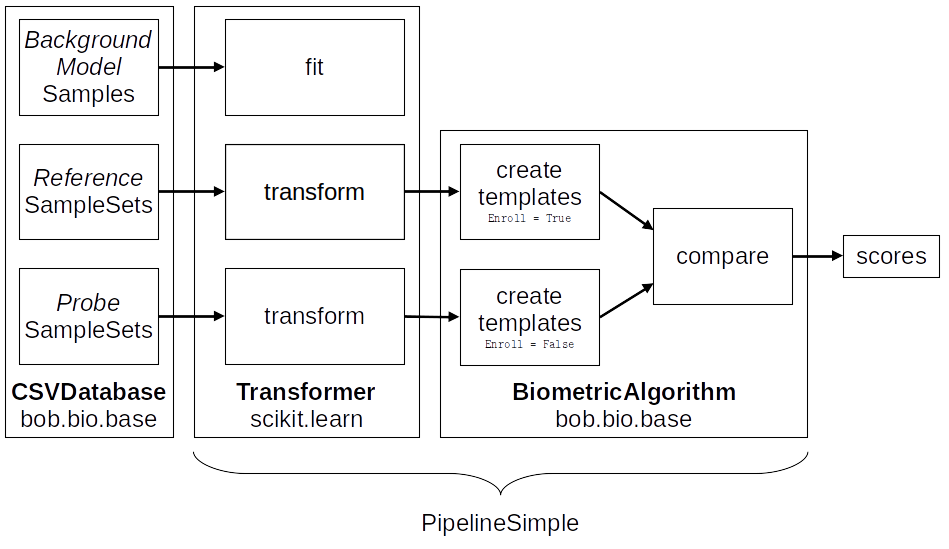

.. author: Tiago de Freitas Pereira <tiago.pereira@idiap.ch>
.. author: Yannick Dayer <yannick.dayer@idiap.ch>
.. date: Wed 18 Aug 2020 10:21:00 UTC+02

..  _bob.bio.base.pipeline_simple_intro:

=====================================================================
Pipeline Simple: Introduction to biometric recognition in practice
=====================================================================

.. note::
  Make sure the following conda packages are installed before following this tutorial::

    conda install bob.bio.face

  The ``bob.bio.face`` package contains the implementation of all face biometric
  databases. Same is true for other ``bob.bio`` packages.

To run biometric experiments, we provide a generic CLI command called ``bob bio pipeline``.
Such CLI command is an entry-point to several pipelines implemented in this package.

In our very first example, we've shown how to compare two samples using the
``bob bio compare-samples`` command, where the "biometric" algorithm is set with
the argument ``--pipeline``. A pipeline is an instance of
:any:`bob.bio.base.pipelines.PipelineSimple`.

Running a biometric experiment with Pipeline Simple
---------------------------------------------------

A ``bob bio pipeline simple`` command is available to run Biometrics experiments from the shell.
Its options can be listed with::

$ bob bio pipeline simple --help

The command accepts a pipeline and a database to run the experiment.

.. _bob.bio.base.build_pipelines:

Building your own Pipeline
--------------------------

The Pipeline Simple represents **the simplest** biometrics pipeline possible and for this reason, is the backbone for any biometric test in this library.
It's composed of:

* One or several :ref:`Transformers <bob.bio.base.transformer>`: Instances of
  :py:class:`sklearn.base.BaseEstimator` and
  :py:class:`sklearn.base.TransformerMixin`. A Transformer can be trained if
  needed and applies one or several transformations on an input sample. It must
  implement a ``Transformer.transform`` and a :py:meth:`Transformer.fit`
  method. Multiple transformers can be chained together, each working on the
  output of the previous one.

* A :ref:`Biometric Algorithm <bob.bio.base.biometric_algorithm>`: Instance of
  :any:`bob.bio.base.pipelines.BioAlgorithm` that implements the methods
  ``create_templates`` and ``compare`` to generate biometric experiment results.

Running the PipelineSimple will retrieve samples from a dataset and generate score files.
It does not encompass the analysis of those scores (Error rates, ROC, DET). This can be done with other utilities of the ``bob.bio`` packages.

.. _bob.bio.base.transformer:

Transformer
^^^^^^^^^^^

Following the structure of
`pipelines of scikit-learn <https://scikit-learn.org/stable/modules/generated/sklearn.pipeline.Pipeline.html>`__,
a Transformer is a class that must implement a ``Transformer.transform``
and a :py:meth:`Transformer.fit` method. This class represents a simple
operation that can be applied to data, like preprocessing of a sample or
extraction of a feature vector from data.

A Transformer must implement the following methods:

.. py:method:: Transformer.transform(X)

  This method takes data (``X``, N samples) as input and returns the corresponding transformed data. It is used for preprocessing and extraction.

.. py:method:: Transformer.fit(X, y=None)

  A Transformer can be trained with its :py:meth:`Transformer.fit` method. For example, for Linear Discriminant Analysis (LDA), the algorithm must first be trained on data.

  This method returns the instance of the class itself (``self``).

.. note::

  Not all Transformers need to be trained (via a ``fit`` method).
  For example, a preprocessing step that crops an image to a certain size does not require training. In this case, the :py:meth:`Transformer.fit` method simply returns ``self``.
  It is best to use :any:`sklearn.preprocessing.FunctionTransformer` to create a transformer that does not require fit.

Below is an example implementing a very simple Transformer applying a custom function on each sample given as input.

.. code-block:: python

    from sklearn.base import TransformerMixin, BaseEstimator

    class CustomTransformer(TransformerMixin, BaseEstimator):
        def transform(self, X):
            transformed_X = my_function(X)
            return transformed_X

        def fit(self, X, y=None):
            return self

        def _more_tags(self):
            return {"requires_fit": False}

or using :any:`sklearn.preprocessing.FunctionTransformer`:

.. code-block:: python

    from sklearn.preprocessing import FunctionTransformer

    def CustomTransformer(**kwargs):
        return FunctionTransformer(my_function, **kwargs)

.. _bob.bio.base.biometric_algorithm:

Biometric Algorithm
^^^^^^^^^^^^^^^^^^^

A biometric algorithm takes as input features of one or more samples to create a
template. Note that in many biometric databases, one template is generated from
multiple samples such as several face images; This is true for both enrollment
and probing templates. Once templates are generated, the biometric algorithm can
compare the probe template to the enrollment template to generate a similarity
score. These two operations are implemented in
:py:meth:`bob.bio.base.pipelines.BioAlgorithm.create_templates` and
:py:meth:`bob.bio.base.pipelines.BioAlgorithm.compare` methods.

A common example of a biometric algorithm class would compute the mean vector of
a feature set (features of several samples to create one template) to generate
a template, and would compare the scoring would be done by measuring the distance between the
unknown mean vector and the enrolled mean vector.

.. py:method:: BiometricAlgorithm.create_templates(list_of_feature_sets, enroll):

  The :py:meth:`bob.bio.base.pipelines.BioAlgorithm.create_templates` method
  takes a list of feature sets (a feature set is composed of features of several
  samples, e.g. images, that will be used to create one template) and returns a
  list of templates. The features are the output of the Transformer. The
  ``enroll`` parameter is a boolean that indicates if the templates are used for
  enrollment or for probing. Some algorithms may create a different template
  format for enrollment and for probing. For example, in the UBM-GMM algorithm (
  see :any:`bob.bio.base.algorithm.GMM`), the enrollment templates are adapted
  GMMs, while probing templates are statistics computed on the UBM.

.. py:method:: BiometricAlgorithm.compare(enroll_templates, probe_templates)

  The :py:meth:`bob.bio.base.pipelines.BioAlgorithm.compare` method takes N
  enroll templates and M probe templates as input and returns an NxM matrix of
  similarity scores by comparing each probe template to each enroll template.
  The templates are the output of the ``create_templates`` method.

Here is a simple example of a custom
:py:class:`bob.bio.base.pipelines.BioAlgorithm` implementation that computes the
mean of multiple samples to create a template, and measures the inverse of the
distance as a similarity score.

.. code-block:: python

    import numpy as np
    from bob.bio.base.pipelines import BioAlgorithm
    class MyAlgorithm(BioAlgorithm):

        def create_templates(self, list_of_feature_sets, enroll):
            # you cannot call np.mean(list_of_feature_sets, axis=1) because the
            # number of features in each feature set may vary.
            return [np.mean(feature_set, axis=0) for feature_set in list_of_feature_sets]

        def compare(self, enroll_templates, probe_templates):
            scores = []
            for enroll_template in enroll_templates:
                scores.append([])
                for probe_template in probe_templates:
                    similarity = 1 / np.linalg.norm(model - probe)
                    scores[-1].append(similarity)
            scores = np.array(scores, dtype=float)
            return scores

Constructing the pipeline
-------------------------

As stated before, a pipeline is a series of Transformers and a BiometricAlgorithm chained together.
In PipelineSimple, 3 sub-pipelines are defined: a training pipeline, an enrollment pipeline, and a scoring pipeline.

  Example of a pipeline showing the sub-pipelines. The data of *references* is used for enrollment and the data of *probes* is used for scoring.
  Each subject's data goes through the Transformer (or series of Transformers) before being given to :py:meth:`BiometricAlgorithm.create_templates` and then to :py:meth:`BiometricAlgorithm.compare`.

Here is the creation of the pipeline combining the Transformer and the BioAlgorithm that we implemented earlier:

.. code-block:: python

  from sklearn.pipeline import make_pipeline
  from bob.pipelines import wrap
  from bob.bio.base.pipelines import PipelineSimple

  # Instantiate the Transformer(s)
  my_transformer = CustomTransformer()
  # make it a sample transformer (explained later)
  my_transformer = wrap(["sample"], my_transformer)

  # Chain the Transformers together
  transformer = make_pipeline(
      my_transformer,
      # Add more transformers here if needed
  )

  # Instantiate the BioAlgorithm
  bio_algorithm = CustomDistance()

  # Assemble the PipelineSimple and execute
  pipeline = PipelineSimple(transformer, bio_algorithm)

Minimal example of a PipelineSimple experiment
--------------------------------------------------

To run a minimal example, let's use the ATNT faces database and execute this pipeline.
The ATNT database is included in this package.

.. note::
    Usually, you need to download the files of each database manually yourself.
    We do not and cannot provide a script that downloads a biometric database automatically due to legal restrictions.

For each database, you need to configure Bob to specify the location of its
files. To do so for e.g. the MOBIO database (no need for ATNT database), run the following command::

  $ bob config set bob.db.mobio.directory ~/datasets/mobio

.. note::
    Since the original files of the ATNT database is included in this package, you can skip the step above.

For more information, see :ref:`bob.extension.rc`.

Find below a complete file containing a Transformer, a Biometric Algorithm, and the construction of the pipeline:

.. literalInclude:: code_samples/pipeline_example.py

To run the simple example above, save that code in a file ``my_pipeline.py`` and enter this command in a terminal::

  $ bob bio pipeline simple -vv /path/to/my_pipeline.py

This will create a file ``results/scores-dev`` containing the distance between each pair of *probe* and *reference* template.

.. note::

  You can specify all options in one ``.py`` file above when
  providing the config file as an argument, like the example.
  To create a sample config file, run::

    $ bob bio pipeline simple --dump-config sample_config.py

Structure of a pipeline
-----------------------

In a serious scenario with more complex and longer implementations, you should
separate the definition of Transformers and BioAlgorithm in different files that
can be swapped more easily.

bob.bio packages also provide commonly used pipelines and databases that you can use.
You can list them with either of the following commands::

  $ bob bio pipeline simple --help
  $ bob bio pipeline simple --dump-config sample_config.py

For example, to test the iresnet100 pipeline on the ATNT database, run::

  $ bob bio pipeline simple -vv atnt iresnet100

The command above is equivalent to the following command::

  $ bob bio pipeline simple -vv \
    bob.bio.base.config.database.atnt \
    bob.bio.face.config.baseline.iresnet100

This information can be obtained by either inspecting the ``setup.py`` of the
relevant pacakge or using the following code snippet:

.. code-block:: python

    import pkg_resources

    for entry_point in pkg_resources.iter_entry_points("bob.bio.config"):
        if entry_point.name not in ("atnt", "iresnet100"):
            continue
        print(entry_point)

See :ref:`bob.extension.framework` for more information.

.. note::

  Many pipelines depend on the fact that you run them like:
  ``bob bio pipeline simple -vv <database> <pipeline>``
  where no ``--database`` and ``--pipeline`` is used **and** the database
  is specified **before** the pipeline.
