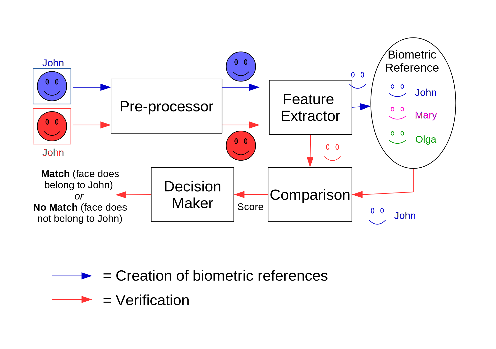
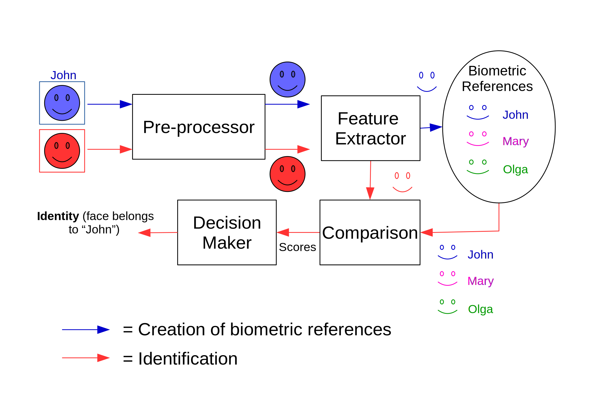

..  _bob.bio.base.struct_bio_rec_sys:

============================================
Structure of a Biometric Recognition System
============================================

This section will familiarize you with the structure of a typical biometric recognition system to help you understand and use the ``bob.bio`` framework to set up your own biometric recognition experiments.

"Biometric recognition" refers to the process of establishing a person's identity based on their biometric data.
A biometric recognition system can operate in one of two modes: *verification* or *identification*.
A *verification* system establishes whether or not a person is who they say they are (i.e., the person claims an identity and the system tries to prove whether or not that claim is true).
On the other hand, an *identification* system attempts to establish a person's identity from scratch (i.e., the system tries to associate a person with an identity from a set of identities in the system's database).  When we are talking about neither verification nor identification in particular, the generic term *recognition* is used.

A biometric recognition system has two stages:

1. **Creation of biometric references:** A person's biometric data is registered to the system's biometric database.
2. **Recognition:** A person's newly acquired biometric data (which we call a *probe*) is compared to a biometric reference (which we refer to as a *model*), and a match score is generated.  The match score tells us how similar the model and the probe are.  Based on match scores, we then decide whether or not the model and probe come from the same person (verification) or which gallery identity should to be assigned to the input biometric (identification).

Fig. 1 shows the creation of biometric references and verification stages in a typical biometric *verification* system:

   Creation of biometric references and verification in a typical biometric verification system.

Fig. 2 shows the creation of biometric references and identification stages in a typical biometric *identification* system:

   Creation of biometric references and identification in a typical biometric identification system.

In the figures above:

* The "Pre-processor" cleans up the raw biometric data to make recognition easier (e.g., crops the face image to get rid of the background).
* The "Feature Extractor" extracts the most important features for recognition, from the pre-processed biometric data.
* The "Biometric references" stores each person's extracted feature set in the form of a representative model for that person in the system database, typically alongside the person's ID.
* In the "Comparison" stage a new biometric feature set (probe) to one (for verification) or all (for identification) models in the database, and outputs a similarity score for each comparison.
* For *verification*, the "Decision Maker" decides whether or not the probe and the model from the database match, based on whether the similarity score is above or below a pre-defined match threshold.  For *identification*, the "Decision Maker" decides which model from the database best represents the identity of the probe, based on which model most closely matches the probe.

Biometric Recognition Experiments in the ``bob.bio`` Framework: The biometric Vanilla Pipeline
----------------------------------------------------------------------------------------------

The ``bob.bio`` framework has the capability to perform both *verification* and *identification* experiments, depending on the user's requirements.
To talk about the framework in generic terms, we will henceforth use the term *recognition*.

In general, the goal of a biometric recognition experiment is to quantify the recognition accuracy of a biometric recognition system, e.g., we wish to find out how good the system is at deciding whether or not two biometric samples come from the same person.

Figures 1 and 2 described pseudo-pipelines on how a biometric recognition system works.
In fact, each one of those figures describe two sub-pipelines.
One that creates **biometric references** given input data; and one that performs **biometric recognition** given input data and biometric references.
Those two sub-pipelines are implemented in ``bob.bio`` using `Dask <https://dask.org/>`_ delayed.

Check it out its documentation on how to create pipelines.
Furthermore, bob.pipelines provides some examples on how to build pipelines using dask and how to deploy them in different computational clusters.

Pipelines for biometric systems can be very complex and full of elements.
This documentation describes the simplest possible biometric pipeline, called, **vanilla-biometrics**.
This pipeline is composed by the two aforementioned sub-pipelines, plus one optional sub-pipeline which are described in the following subsections.

Optional sub pipeline 0 - Training background model
*****************************************************

.. _vanilla-pipeline-0:

Very often biometric systems rely in some "offline" modelling.
Such modelling, for instance, can encompass the training of custom feature extractors (Neural Networks, PCA, LDA, ...), custom preprocessors, or any statistical modeling used for creating biometric references and/or do biometric recognition.
This is often called "Background modeling" and depending on the biometric system that it's being tested, can be a mandatory step.

This sub-pipeline supports such operation and it's composed by, at least, three elements in the following order: i-) `Preprocessing`, ii-) `Feature extraction` and iii-)`Background modelling training.`.
The output of this sub-pipeline is the trained background model. 

Each one of these steps are described further in this chapter.

Sub pipeline 1 - Creation of biometric references
*************************************************

.. _vanilla-pipeline-1:

As the name suggests, this sub-pipeline takes care of the creation of biometric references.
In this sub-pipeline, one or more biometric samples per person are used to compute a representative "model" for that person, which essentially represents its "identity".

This sub-pipeline is composed by, at least, three elements in the following order: i-) `Preprocessing`, ii-) `Feature extraction` and iii-`Creation of Biometric references`.
The biometric reference is then calculated using the corresponding biometric features extracted in the Feature Extraction stage.

Depending on the biometric algorithm used, the background model trained in the previous sub-pipeline is also used as input of this one.

Sub pipeline 2 - Biometric Recognition
**************************************

.. _vanilla-pipeline-2:

As the name suggests, this sub-pipeline takes care of the biometric recognition and essentially works as follows.
Each biometric reference is associated with a number of probes samples.
Every biometric reference is then compared to its associated set of probes samples (some of which come from the same person, and some of which come from different people), and a score is calculated for each comparison.
Such score describes the similarity between the biometric reference and the probe (higher scores indicate greater similarity); for example, it can be computed as a negative distance between the model and probe features.
Ideally, if the biometric reference and probe sample come from the same biometric (e.g., two images of the same finger), they should be very similar, and if they come from different sources (e.g., two images of different fingers) then their similarity should be low. 

This sub-pipeline is composed by, at least, three elements in the following order: i-) `Preprocessing`, ii-) `Feature extraction` and iii-)`Biometric recognition`.
Each one of these steps are described later in this chapter.

The scores has the following text format:

.. code-block:: text

   subject-id_1 suject-probe-id_1 probe-sample score
   subject-id_1 suject-probe-id_2 probe-sample score
   ...
   subject-id_n suject-probe-id_m probe-sample score

Depending on the biometric algorithm used, the background model trained in the previous sub-pipeline is also used as input of this one.

Stages
------

Each one of the previously mentioned sub-pipelines, have in common some processing steps, for instance, `Preprocessing` and `Feature Extraction`.
Each one of these stages is discussed below.

Data Preprocessing:
*******************

Biometric measurements are often noisy, containing redundant information that is not necessary (and can be misleading) for recognition.
For example, face images contain non-face background information, vein images can be unevenly illuminated, speech signals can be littered with background noise, etc.
The aim of the data preprocessing stage is to clean up the raw biometric data so that it is in the best possible state to make recognition easier.
For example, biometric data is cropped from the background, the images are photometrically enhanced, etc.

All the biometric samples in the input biometric database go through the preprocessing stage.
For each sub-pipeline, the results are stored in a directory entitled "preprocessed".
This process is illustrated in Fig. 3:

   Preprocessing stage in ``bob.bio``'s biometric recognition experiment framework.

Feature Extraction:
*******************

Although the preprocessing stage produces cleaner biometric data, the resulting data is usually very large and still contains much redundant information.
The aim of the feature extraction stage is to extract features that are necessary for recognizing a person.

All the biometric features stored in the "preprocessed" directory go through the feature extraction stage.
The results are stored in a directory entitled "extracted".
This process is illustrated in Fig. 4:

   Feature extraction stage in ``bob.bio``'s biometric recognition experiment framework.

.. note::
   Prior to the feature extraction there is an *optional* feature extractor training stage (to help the extractor to learn which features to extract) that uses the training data provided by the database.

Decision Making:
****************

The decision making stage in ``bob.bio`` is referred to as "Evaluation".  If we wish to perform *verification*, then the aim of this stage will be to make a decision as to whether each score calculated in the Matching stage indicates a "Match" or "No Match" between the particular model and probe biometrics.  If we wish to perform *identification*, then the aim of the evaluation stage will be to find the model which most closely matches the probe biometric.

Once a decision has been made, we can quantify the overall performance of the particular biometric recognition system in terms of common metrics like the False Match Rate (FMR), False Non Match Rate (FNMR), and Equal Error Rate (EER) for verification, and Identification Rate (IR) for identification.  We can also view a visual representation of the performance in terms of plots like the Receiver Operating Characteristic (ROC) and Detection Error Trade-off (DET) for verification, Cumulative Match Characteristics (CMC) for closed-set identification, and Detection and Identification Rate (DIR) for open-set identification.  Fig. 8 illustrates the Evaluation stage:

   Evaluation stage in ``bob.bio``'s biometric recognition experiment framework.

Input Data
**********

To conduct a biometric recognition experiment, we need biometric data.
Hence, we use a biometric database.
A biometric database generally consists of multiple samples of a particular biometric, from multiple people.
For example, a face database could contain 5 different images of a person's face, from 100 people.
The dataset is split up into samples used for the creation of biometric references, and samples used for recognition.
We create biometric references for each identity from one or more of its faces.
We then simulate "genuine" recognition attempts by comparing each person's probe samples to their enrolled models.
We simulate "impostor" recognition attempts by comparing the same probe samples to models of different people.
Which data is used for training, creation of biometric references and probing is defined by the evaluation *protocol* of the database.
The protocol also defines, which models should be compared to which probes.

.. include:: links.rst
