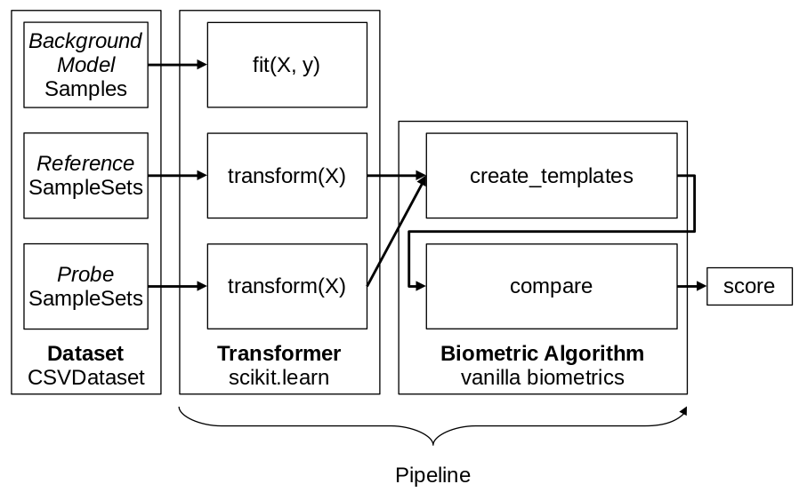

.. author: Tiago de Freitas Pereira <tiago.pereira@idiap.ch>
.. author: Yannick Dayer <yannick.dayer@idiap.ch>
.. date: Wed 18 Aug 2020 10:21:00 UTC+02

..  _bob.bio.base.vanilla_biometrics_intro:

=====================================================================
Vanilla Biometrics: Introduction to biometric recognition in practice
=====================================================================

To run biometric experiments, we provide a generic CLI command called ``bob bio pipelines``.
Such CLI command is an entry-point to several pipelines implemented under :py:mod:`bob.pipelines`.
This tutorial will focus on the pipeline called **vanilla-biometrics**.

In our very first example, we've shown how to compare two samples using the ``bob bio compare-samples`` command, where the "biometric" algorithm is set with the argument ``-p``.
The ``-p`` points to a so-called :py:mod:`~bob.bio.base.pipelines.VanillaBiometricsPipeline`.

Running a biometric experiment with Vanilla Biometrics
------------------------------------------------------

A set of commands are available to run Vanilla Biometrics experiments from the shell. Those are in the form of::

$ bob bio pipelines vanilla-biometrics [OPTIONS] -p <pipeline>

With the -p option being mandatory as it specifies the configuration of the pipeline.
The other options can be listed with::

$ bob bio pipelines vanilla-biometrics --help

.. _bob.bio.base.build_pipelines:

Building your own Vanilla Biometrics pipeline
---------------------------------------------

The Vanilla Biometrics represents **the simplest** biometrics pipeline possible and for this reason, is the backbone for any biometric test in this library.
It's composed of:

  :ref:`Transformers <bob.bio.base.transformer>`: Instances of :py:class:`sklearn.base.BaseEstimator` and :py:class:`sklearn.base.TransformerMixin`. A Transformer can be trained if needed and applies one or several transformations on an input sample. It must implement a :py:meth:`~Transformer.transform` and a :py:meth:`~Transformer.fit` method. Multiple transformers can be chained together, each working on the output of the previous one.

  A :ref:`Biometric Algorithm <bob.bio.base.biometric_algorithm>`: Instance of :py:class:`~bob.bio.base.pipelines.vanilla_biometrics.abstract_classes.BioAlgorithm` that implements the methods :py:meth:`enroll` and :py:meth:`score` to generate biometric experiment results.

Running the vanilla-biometric pipeline will retrieve samples from a dataset and generate score files.
It does not encompass the analysis of those scores (Error rates, ROC, DET). This can be done with other utilities of the ``bob.bio`` packages.

.. _bob.bio.base.transformer:

Transformer
^^^^^^^^^^^

Following the structure of `pipelines of scikit-learn <https://scikit-learn.org/stable/modules/generated/sklearn.pipeline.Pipeline.html>`__, a Transformer is a class that must implement a :py:meth:`~Transformer.transform` and a :py:meth:`~Transformer.fit` method.
This class represents a simple operation that can be applied to data, like preprocessing of a sample or extraction of a feature vector from data.

A :py:class:`Transformer` must implement the following methods:

.. py:method:: Transformer.transform(data)

  This method takes data as input and returns the corresponding transformed data. It is used for preprocessing and extraction.

.. py:method:: Transformer.fit(data,label)

  A :py:class:`Transformer` can be trained with its :py:meth:`~Transformer.fit` method. For example, for Linear Discriminant Analysis (LDA), the algorithm must first be trained on data.

  This method returns the trained instance of the :py:class:`Transformer` class, or the instance of the class itself (``self``) if the :py:class:`Transformer` is not trainable.

.. note::

  Not all Transformers need to be trained (via a :py:meth:`fit` method).
  For example, a preprocessing step that crops an image to a certain size does not require training. In this case, the :py:meth:`~Transformer.fit` method returns ``self``.

Below is an example implementing a very simple :py:class:`Transformer` applying a custom function on each sample given as input.

.. code-block:: python

  from sklearn.base import TransformerMixin, BaseEstimator

  class CustomTransformer(TransformerMixin, BaseEstimator):
    def transform(self, X):
      transformed_X = my_function(X)
      return transformed_X

      def fit(self, X, y=None):
        return self

.. _bob.bio.base.biometric_algorithm:

Biometric Algorithm
^^^^^^^^^^^^^^^^^^^

A biometric algorithm represents the enrollment and scoring phase of a biometric experiment.

A biometric algorithm is a class implementing the method :py:meth:`~bob.bio.base.pipelines.vanilla_biometrics.abstract_classes.BioAlgorithm.enroll` that allows to save the identity representation of a subject, and :py:meth:`~bob.bio.base.pipelines.vanilla_biometrics.abstract_classes.BioAlgorithm.score` that computes the score of a subject's sample against a previously enrolled model.

A common example of a biometric algorithm class would compute the mean vector of the features of each enrolled subject, and the scoring would be done by measuring the distance between the unknown identity vector and the enrolled mean vector.

.. py:method:: BiometricAlgorithm.enroll(reference_sample)

  The :py:meth:`~bob.bio.base.pipelines.vanilla_biometrics.abstract_classes.BioAlgorithm.enroll` method takes extracted features (data that went through transformers) of the *reference* samples as input.
  It should save (on memory or disk) a representation of the identity of each subject for later comparison with the :py:meth:`~bob.bio.base.pipelines.vanilla_biometrics.abstract_classes.BioAlgorithm.score` method.

.. py:method:: BiometricAlgorithm.score(model,probe_sample)

  The :py:meth:`~bob.bio.base.pipelines.vanilla_biometrics.abstract_classes.BioAlgorithm.score` method also takes extracted features (data that went through transformers) as input but coming from the *probe* samples.
  It should compare the probe sample to the model and output a similarity score.

Here is a simple example of a custom :py:class:`~bob.bio.base.pipelines.vanilla_biometrics.abstract_classes.BioAlgorithm` implementation that computes a model with the mean of multiple reference samples, and measures the inverse of the distance as a similarity score.

.. code-block:: python

  from bob.bio.base.pipelines.vanilla_biometrics.abstract_classes import BioAlgorithm

  class CustomDistance(BioAlgorithm):
    def enroll(self, enroll_features):
      model = numpy.mean(enroll_features, axis=0)
      return model

    def score(self, model, probe):
      distance = 1/numpy.linalg.norm(model-probe)
      return distance

Constructing the pipeline
-------------------------

As stated before, a pipeline is a series of :py:class:`Transformers` and a :py:class:`BiometricAlgorithm` chained together.
In Vanilla biometrics, 3 sub-pipelines are defined: a training pipeline, an enrollment pipeline, and a scoring pipeline.

  Example of a pipeline showing the sub-pipelines. The data of *references* is used for enrollment and the data of *probes* is used for scoring.
  Each subject's data goes through the Transformer (or series of Transformers) before being given to :py:meth:`~BiometricAlgorithm.enroll` or :py:meth:`~BiometricAlgorithm.score`.

Here is the creation of the pipeline combining the Transformer and the BioAlgorithm that we implemented earlier:

.. code-block:: python

  from sklearn.pipeline import make_pipeline
  from bob.pipelines import wrap
  from bob.bio.base.pipelines.vanilla_biometrics import VanillaBiometricsPipeline

  # Instantiate the Transformer(s)
  my_transformer = CustomTransformer()

  # Chain the Transformers together
  transformer = make_pipeline(
      wrap(["sample"], my_transformer),
      # Add more transformers here if needed
  )

  # Instantiate the BioAlgorithm
  bio_algorithm = CustomDistance()

  # Assemble the Vanilla Biometric pipeline and execute
  pipeline = VanillaBiometricsPipeline(transformer, bio_algorithm)

  # The `pipeline` variable will be used by the vanilla-pipeline script

Then to execute this pipeline the following command can be executed, using the AT&T face dataset::

$ bob bio pipelines vanilla-biometrics --pipeline my_pipeline.py --database atnt --output results

This will create a ``results`` folder with a ``scores-dev`` file in it containing the similarity score for each probe against every model.

Minimal example of the vanilla-biometrics pipeline
--------------------------------------------------

Find below a complete file containing a Transformer, a Biometric Algorithm, and the construction of the pipeline:

.. This raw html is used to create a "hidden" code block that can be revealed by clicking on its summary

.. raw:: html

  

  
Complete pipeline construction

.. literalInclude:: code_samples/pipeline_example.py

.. raw:: html

  

To run the simple example above, save that code in a file ``my_pipeline.py`` and enter this command in a terminal::

$ bob bio pipelines vanilla-biometrics -d atnt -p my_pipeline.py -o results

This will create a file ``results/scores-dev`` containing the distance between each pair of *probe* and *reference* sample.

Structure of a pipeline package
-------------------------------

In a serious scenario with more complex and longer implementations, you should separate the definition of Transformers and BioAlgorithm in different files that can be swapped more easily.

bob.bio packages also provide commonly used Transformers and BioAlgorithm that you can import. You can list them with the following command::

$ resources.py

