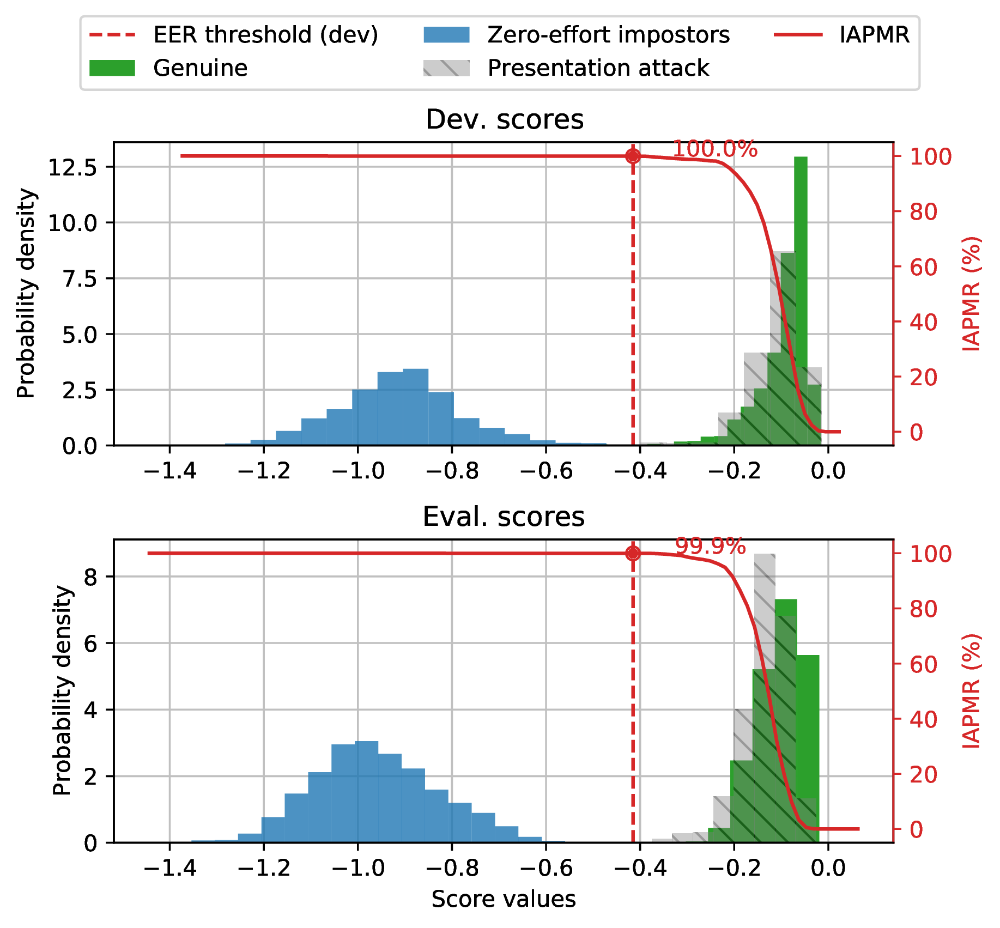

.. author: Yannick Dayer <yannick.dayer@idiap.ch>
.. date: 2021-04-14 09:39:37 +02

.. _bob.bio.base.vulnerability_analysis:

======================
Vulnerability analysis
======================

When developing a biometric system, one could be interested in knowing how it
performs when under attack. This is where the vulnerability to presentation
attacks comes in. This analysis allows to test a variety of attacks and assess
the cases where a biometric system is fooled.

For more details on the vulnerability analysis of biometric systems, refer to
[Chingovska_SPRINGER_2019]_.

To evaluate a biometric system for vulnerability to presentation attack, three steps
must be accomplished:

- Preparing the data to feed the biometric system (using a ``CSVDatabase``);
- Running a pipeline to generate comparison scores (``bob bio pipelines``);
- Analyzing the resulting scores to assess the performance of the system
  (``bob vulnerability`` commands).

Using a ``CSVDatabase``
-----------------------

A ``CSVDatabase`` interface is needed to correctly feed the data to the
PipelineSimple.
You can use an already existing configuration (like ``replaymobile-img``), when
present.
If not, you will need to create your own. To do so, you need at least those three
elements:

  - The raw data files (e.g. face images or videos);
  - A series of CSV protocol files;
  - A configuration file instantiating the ``CSVDatabase`` with your parameters.

In some specific cases (e.g. frames needing to be extracted from a video file), the
base ``CSVDatabase`` could not satisfy your needs, and a new class inheriting from it
would have to be implemented.

Data files
^^^^^^^^^^

The data files are never provided via the bob packages, as they contain private
biometric information that can not be distributed. You have to retrieve them from their
author (sometimes requiring a consent form to be approved) or create your own.

CSV protocol files
^^^^^^^^^^^^^^^^^^

These files define which sample from the data files will be used and for which purpose
(training, enrollment, or probe). A specific file structure must be observed, as well
as some formatting rules in the files.

File structure of the CSV protocol files
........................................

The CSV protocol files must be ordered in the following structure with the correct file
names:

.. code-block:: text

  <your_dataset_name>
  |
  +-- <your_protocol_name_1>
  |   |
  |   +-- dev
  |       |
  |       +-- for_models.csv
  |       +-- for_probes.csv
  |
  +-- <your_protocol_name_2>
  .   |
  .   +-- norm
  .   |   |
      |   +-- train_world.csv
      |
      +-- dev
      |   |
      |   +-- for_models.csv
      |   +-- for_probes.csv
      |
      +-- eval
          |
          +-- for_models.csv
          +-- for_probes.csv

Each subfolder of the top-level folder contains a protocol definition whose name can be
chosen and will be compared to the ``protocol_name`` parameter passed in the
``CSVDatabase`` configuration.

Each protocol folder must contain at least a ``dev`` folder and can contain a ``norm``
and/or an ``eval`` folder.

The ``dev`` and ``eval`` folders each contain a ``for_models.csv`` file that will be
used to enroll the samples listed in it, and a ``for_probes.csv`` file that contains
the genuine and attack probes samples that will be compared to the enrolled models.

CSV protocol files format
.........................

Each CSV file must contain a header and its content must be separated by commas. The
required columns for vulnerability analysis are ``path`` and ``template_id``.
Other column fields (metadata) will be processed by the ``CSVDatabase`` class and
passed through the samples to the pipeline.
Each row of the CSV files will result in **one** sample being created (each frame of a
video must be one row when processing images).

The ``attack_type`` field can be omitted in the model files but must be present in the
probe files. When the sample is not an attack, the ``attack_type`` field should be
empty, otherwise, it represents the type of attack used.

Minimal protocol definition CSV file for the enrollment (``for_models.csv``):

.. code-block:: text

  PATH,TEMPLATE_ID
  enroll/client01/im01,1
  enroll/client01/im02,1
  enroll/client02/im01,2
  enroll/client02/im02,2
  ...

Minimal vulnerability probes protocol definition CSV file (``for_probes.csv``), where
each row corresponds to **one comparison** (``is_sparse`` needs to be set in the
``CSVDatabase``):

.. code-block:: text

  PATH, TEMPLATE_ID, ATTACK_TYPE, COMPARE_TEMPLATE_ID
  probe/client01/im01,1,,1
  probe/client01/im01,1,,2
  probe/client01/im01,1,,3
  probe/client01/im01,1,,4
  probe/client01/im01,1,spoof,1
  probe/client02/im01,2,,1
  probe/client02/im01,2,,2
  probe/client02/im01,2,,3
  probe/client02/im01,2,,4
  probe/client02/im01,2,spoof,2
  ...

Note that building the probe file this way (instead of one rew per probe) is recommended
to prevent the computation of attack probes against unrelated references.
The ``compare_template_id`` specifies to which reference the probe will be compared to.

The ``CSVDatabase`` interface
^^^^^^^^^^^^^^^^^^^^^^^^^^^^^

If you want to use a dataset that is already configured for bob vulnerability you don't
need to create the configuration file in this step; you can use the one provided in the
bob package (see next chapter, using ``replaymobile-img``).

Otherwise, once you have the protocol files and the data, you can define a
configuration file to input in the PipelineSimple pipeline. This configuration
file must assign a ``database`` object to an instance of
:py:class:`bob.bio.base.database.CSVDatabase` (or your own inheriting class if some
special processing is needed for the loading of your samples).

To use the default ``CSVDatabase`` for your dataset, the python configuration file to
use can be in the form:

.. code-block:: python

  from bob.bio.base.database import CSVDatabase, FileSampleLoader

  database = CSVDatabase(
      dataset_protocols_path="path/to/definition/of/your_dataset_name",
      protocol_name="your_protocol_name",
      sample_loader=FileSampleLoader(
          data_loader=bob.io.base.load,
          dataset_original_directory="path/to/raw_data_folder",
          extension=".png",
      ),
      is_sparse=True,
  )

The ``is_sparse`` parameter is used in pair with the ``compare_template_id`` column in
the CSV definition files. It allows to define specifically which comparisons should be
computed, by defining each row as one comparison between a probe sample and the
reference specified in the ``compare_template_id`` column.

The custom configuration file (``custom_database_config.py``, here) has to be given as
parameter to the PipelineSimple command:

.. code-block:: sh

  $ bob bio pipeline simple custom_database_config.py facenet-sanderberg

Computing the scores
--------------------

To evaluate a biometric system, a series of samples coming from a dataset is compared
to multiple enrolled models, and each comparison should result in a score.
Generally, the score should be high if the compared samples come from the same
individual represented in the model.

In the case of vulnerability analysis, presentation attack samples are also
compared to the enrolled model of the attacked individual and give a score.
Ideally, the system should not recognize the attack sample and return a low score
to those comparisons. But if the attack is well crafted enough to fool the system,
these attack samples will pass as genuine and score higher.

To compute the comparison scores of a dataset on a system, the PipelineSimple
pipeline can be used.
For a face presentation attack analysis (using the `replay mobile` dataset as an
example) on a face recognition system (`Facenet` from Sandberg, in this case), use the
following command:

.. code-block:: sh

  $ bob bio pipeline simple -v --output ./results \
    --group dev --group eval replaymobile-img facenet-sanderberg

``replaymobile-img`` points to a python configuration file defining a ``database``
object.

``facenet-sanderberg`` points to a python configuration file defining a ``pipeline``
object.

.. note::

  The data (face images) is **not** provided in the bob packages, as it contains
  private information. Only the protocol definition files and annotations are available
  and will be automatically downloaded unless specified, as they are anonymous.
  You must acquire the data files and specify their location using the ``bob config``
  command, or specifying it in your own configuration files.

  When using ``replaymobile-img``, do:

  .. code-block:: sh

    $ bob config set bob.db.replaymobile.directory /your/path/to/replay-mobile/database

Analyzing the scores
--------------------

To evaluate the performance of the system, we can analyze the distribution of
scores generated by the ``pipelines`` command. This analysis step includes a series of
commands that generate plots and tables of metrics. Those are useful to assess the
performance and vulnerability of the system or to compare multiple systems'
performance.

Each command is in the form:

.. code-block:: sh

  $ bob vulnerability <command> <options> <score files>

or alternatively:

.. code-block:: sh

  $ bob vuln <command> <options> <score files>

For a list of available commands, run:

.. code-block:: sh

  $ bob vuln --help

For more information on a specific command (available options, number of score
files needed), you can use the integrated help option available for each command:

.. code-block:: sh

  $ bob vuln metrics --help

Metrics
^^^^^^^

The ``metrics`` command generates a list of useful metrics (FMR, FNMR, IAPMR, etc.) for
a specific operating point (threshold value).

It is possible to specify a value for the threshold, or a criterion can be used
to compute this value automatically by minimizing an error rate.

This command is useful to get a quick evaluation of a system on a single
operating point.

Example:

.. code-block:: sh

  $ bob vuln metrics --eval results/scores-{dev,eval}.csv

Output:

.. code-block:: text

  [Min. criterion: EER ] Threshold on Development set `results/scores-dev.csv`: -4.150729e-01
  ==============================  ==================  =================
  ..                              Development         Evaluation
  ==============================  ==================  =================
  Licit Failure to Acquire        0.0%                0.4%
  Licit False Match Rate          0.1% (30/24000)     0.0% (0/12056)
  Licit False Non Match Rate      0.1% (2/1600)       0.2% (2/1096)
  Licit False Accept Rate         0.1%                0.0%
  Licit False Reject Rate         0.2%                0.6%
  Licit Half Total Error Rate     0.1%                0.1%
  Attack Presentation Match Rate  100.0% (2548/2549)  99.9% (1901/1902)
  ==============================  ==================  =================

Histograms
^^^^^^^^^^

The ``hist`` command plots the different distributions (positives, negatives,
as well as spoof) of the scores, allowing to visualize if a biometric system can
distinguish impostors and attacks from genuine samples.

The threshold value for EER can be displayed. When using a development and
evaluation set, the threshold value is computed only on the dev set and
reported to the eval graph.

Example:

.. code-block:: sh

  $ bob vuln hist --eval results/scores-{dev,eval}.csv --output results/hist.pdf --figsize "6,5"

Output:

  Histogram of genuine, zero-effort impostor, and attack impostor scores.

ROC and DET
^^^^^^^^^^^

The ``roc`` and ``det`` commands plot the FMR against the FNMR of a system
allowing for example to assess the resulting FMR for a wanted minimum FNMR
value.

For vulnerability, the IAPMR is also plotted against the FNMR.

Example:

.. code-block:: sh

  $ bob vuln roc --eval results/scores-{dev,eval}.csv --output results/roc.pdf --figsize "6,4"

Output:

.. figure:: img/vuln_plots/roc.png
  :figwidth: 95%
  :align: center
  :alt: ROC of vulnerability scores.

  ROC of `dev` and `eval` groups. The annotated threshold value is chosen on `dev`.

IAPMR vs FMR
^^^^^^^^^^^^

The ``fmr-iapmr`` command plots the IAPMR against the FMR, allowing to see the
ratio of accepted attacks given an FMR value.

Example:

.. code-block:: sh

  $ bob vuln fmr-iapmr results/scores-{dev,eval}.csv --output results/fmr_iapmr.pdf --legends "replay-mobile"

Output:

.. figure:: img/vuln_plots/fmr_iapmr.png
  :figwidth: 75%
  :align: center
  :alt: FMR vs IAPMR of vulnerability scores.

  Plot of the IAPMR vs the FMR for various threshold values.

EPSC
^^^^

The ``epsc`` command plots the WER and IAPMR for different values of :math:`\beta` and
:math:`\omega` parameters used to compute this error rate.

Since two variables are in play, one of them can be set and the other plotted, or a
three-dimensional plot can be drawn.

It is also possible to only draw the WER or the IAPMR plot.

Example:

.. code-block:: sh

  $ bob vuln epsc results/scores-{dev,eval}.csv --output results/epsc.pdf --fixed-params "0.5,0.6" --figsize "8,4"

Output:

.. figure:: img/vuln_plots/epsc.png
  :figwidth: 95%
  :align: center
  :alt: EPSC of vulnerability scores.

  EPSC with :math:`\omega` varying and :math:`\beta` set at 0.5 and 0.6.

EPC
^^^

The ``epc`` command plots the EPC of the system with the IAPMR overlaid on top.

Example:

.. code-block:: sh

  $ bob vuln epc results/scores-{dev,eval}.csv --output results/epc.pdf

Output:

.. figure:: img/vuln_plots/epc.png
  :figwidth: 75%
  :align: center
  :alt: EPC of vulnerability scores.

  EPC of the system with the corresponding IAPMR curve.

Evaluate
^^^^^^^^

The ``evaluate`` command creates a single report with multiple plots to display
different aspects of the evaluation.

Example:

.. code-block:: sh

  $ bob vuln evaluate results/scores-{dev,eval}.csv --output results/report.pdf

References
----------

.. [Chingovska_SPRINGER_2019]   * Chingovska, Ivana and Mohammadi, Amir and Anjos, André and Marcel, Sébastien **Evaluation methodologies for biometric presentation attack detection**, 2019, Springer
